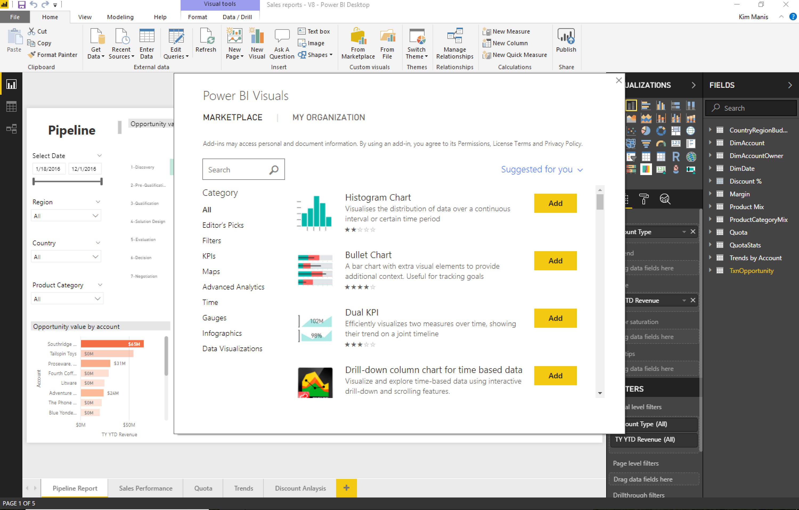

---

title: Organizational visuals store
description: Power BI admins can deploy visuals as part of an organizational repository.
author: MargoC
manager: AnnBe
ms.date: 4/27/2018
ms.topic: article
ms.prod: 
ms.service: business-applications
ms.technology: 
ms.author: margoc
audience: Admin

---
#  Organizational visuals store 

[!include[banner](../../../includes/banner.md)]

Power BI admins can deploy visuals as part of an organizational repository.
Deployed visuals display under a section of the Power BI custom visual store
called MY ORGANIZATION.

*Marketplace for Power BI Visuals*

