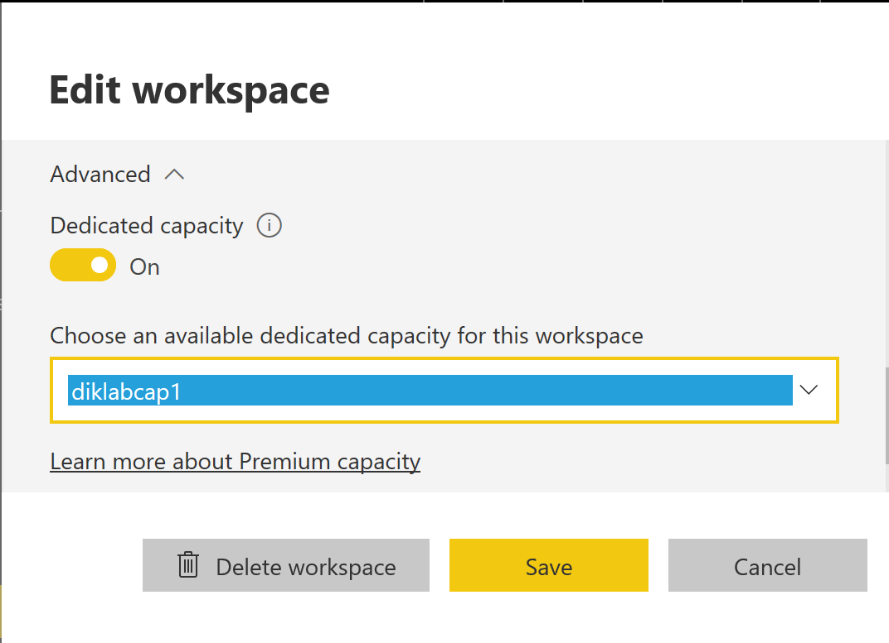

---

title: Capacity API
description: Use capacity APIs to assign or remove workspaces to capacities, and get a list of capacities a user can access.
author: MargoC
manager: AnnBe
ms.date: 4/27/2018
ms.topic: article
ms.prod: 
ms.service: business-applications
ms.technology: 
ms.author: margoc
audience: Admin

---
#  Capacity API

[!include[banner](../../../includes/banner.md)]

Use capacity APIs to assign or remove workspaces to capacities, and get a list
of capacities a user can access.

Currently, through the Power BI portal, a workspace admin with capacity assign
permissions can use the **Edit workspace** dialog box to assign a capacity to a
workspace.

<!-- PBIE_assign WS_A.PNG -->

*Edit workspace options*

With the [AssignToCapacity
API](https://msdn.microsoft.com/library/mt829293.aspx), you can manage a
workspace with a Power BI Premium/Azure capacity, such as assign or remove the
workspace from a capacity, or move between capacities.

Use the [GetCapacities
API](https://msdn.microsoft.com/en-us/library/mt829294.aspx) to get a list of
all the capacities a user has access to as a capacity admin and their assignment
permissions. An additional property that states the capacity where a workspace
resides, is available in the existing [GetGroups
API](https://msdn.microsoft.com/en-us/library/mt243842.aspx).

These Capacity API additions provide an enhanced ALM experience to onboard new
customers by using a workspace for each customer. Here are the steps to automate
the process:

1.  [Clone
    workspace](https://powerbi.microsoft.com/en-us/blog/duplicate-workspaces-using-the-power-bi-rest-apis-a-step-by-step-tutorial/)
    with the analytical content for a new customer.

2.  [Connect the cloned
    content](https://msdn.microsoft.com/en-us/library/mt814715.aspx) to the
    customer’s data source.

3.  Get the customer into production by assigning the cloned workspace to a
    dedicated capacity.
