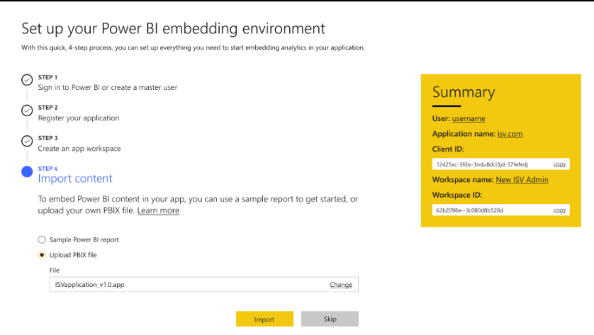

---

title: Onboarding experience for Power BI Embedded
description: Setting up a new environment to develop and deploy Power BI Embedded involved defining and configuring several entities.
author: MargoC
manager: AnnBe
ms.date: 4/27/2018
ms.topic: article
ms.prod: 
ms.service: business-applications
ms.technology: 
ms.author: margoc
audience: Admin

---
#  Onboarding experience for Power BI Embedded 

[!include[banner](../../../includes/banner.md)]

Setting up a new environment to develop and deploy Power BI Embedded involved
defining and configuring several entities. With the new onboarding tool, the
process is faster and easier to complete.

*Power BI embedding environment setup*

The Power BI Embedded setup is done in four steps. With each step, the
information required for the application to work is being added to the
**Summary** tile on the right. The last step of the tool enables importing a
report based on which an application will be created for the developer. The
application can be used as a sample or reference to start with.
