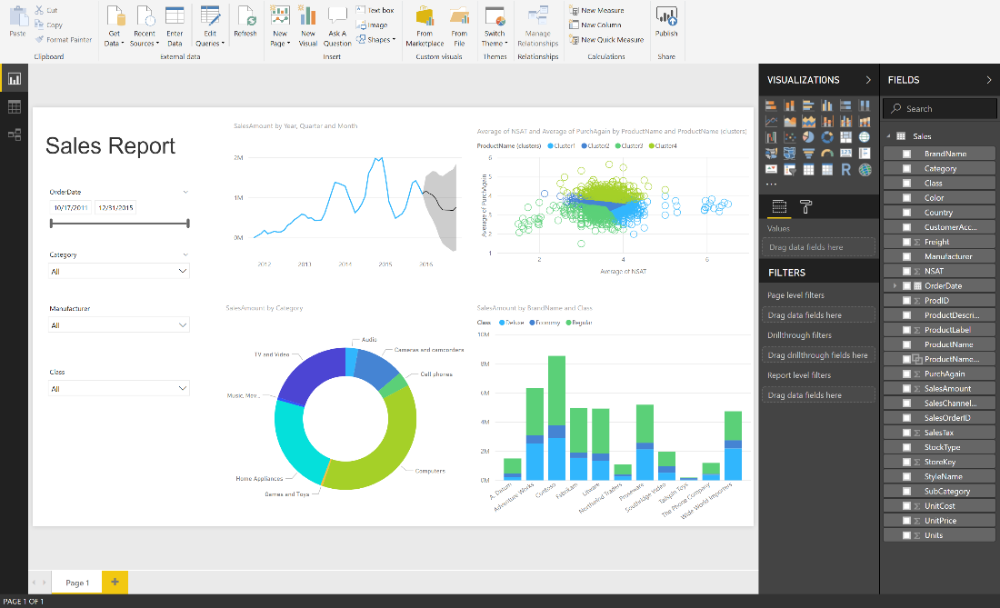

---

title: Themes support
description: With **report themes,** you can apply a color theme to your entire report, such as corporate colors, seasonal coloring, or any other color theme you might want to apply.
author: MargoC
manager: AnnBe
ms.date: 4/27/2018
ms.topic: article
ms.prod: 
ms.service: business-applications
ms.technology: 
ms.author: margoc
audience: Admin

---
#  Themes support 

[!include[banner](../../../includes/banner.md)]

With **report themes,** you can apply a color theme to your entire report, such
as corporate colors, seasonal coloring, or any other color theme you might want
to apply. When you apply a **report theme**, all visuals in your report use the
colors from your selected theme.

<!-- picture -->

*Apply themes to a report*

Applying a **report theme** requires a JSON file, which you can then import into
Power BI Desktop and apply to your report. The JSON file structure and the
process of importing are quick and easy.

You can also use APIs to apply and change themes on a session level for an
embedded object.
