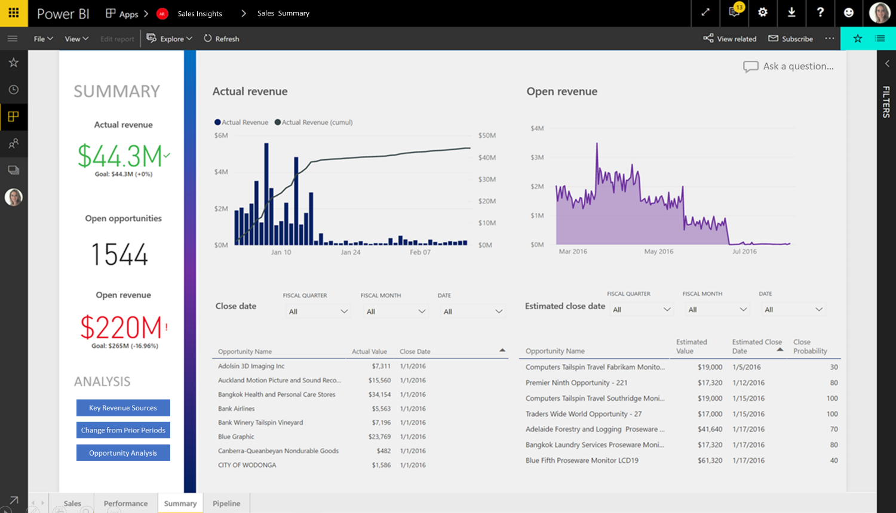

---

title: Power BI for Sales Insights
description: The Power BI for Sales Insights app brings in key entities from either Dynamics 365 or Salesforce.
author: MargoC
manager: AnnBe
ms.date: 4/27/2018
ms.topic: article
ms.prod: 
ms.service: business-applications
ms.technology: 
ms.author: margoc
audience: Admin

---
#  Power BI for Sales Insights

[!include[banner](../../../includes/banner.md)]

The Power BI for Sales Insights app brings in key entities from either
Dynamics 365 or Salesforce. Sales managers can to track sales performance across
products and salespeople. They can also monitor the health of their pipeline and
quickly identify at-risk accounts that they may want to focus their attention
on. The app provides key KPIs like win ratios, lead conversion rates, and
year-to-date (YTD) revenue.

<!-- picture -->

*Example of Sales Insights*
