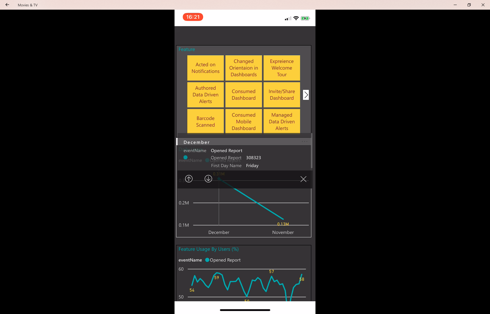

---

title: Drill-down and drill-up support
description: Mobile users can use drill-down and drill-up to dive deep into their data.
author: MargoC
manager: AnnBe
ms.date: 4/27/2018
ms.topic: article
ms.prod: 
ms.service: business-applications
ms.technology: 
ms.author: margoc
audience: Admin

---
#  Drill-down and drill-up support

[!include[banner](../../../includes/banner.md)]

Mobile users can use drill-down and drill-up to dive deep into their data. This
brings our mobile users more data analysis and investigation capabilities,
allowing them to get the insights in their data. Drill down and up is enabled
from the report visual’s tooltip menu. Tapping on a visual data point will pop
the menu and if drill down or drill up is defined, additional drill buttons are
presented and enabled for tapping.

<!-- Picture 2 -->

*Drill up or down into data (for mobile)*
