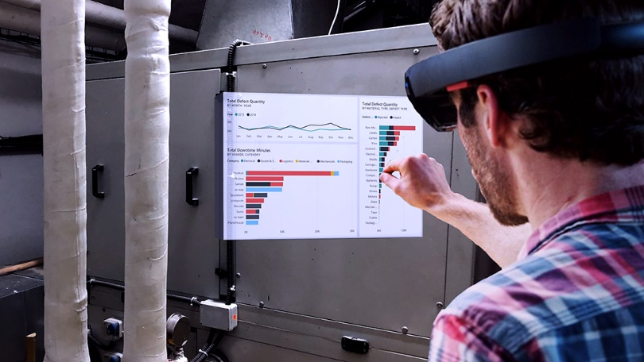

---

title: Power BI for mixed reality (Public Preview)
description: A preview release of Power BI for Mixed Reality targeted to first line task workers.
author: MargoC
manager: AnnBe
ms.date: 4/27/2018
ms.topic: article
ms.prod: 
ms.service: business-applications
ms.technology: 
ms.author: margoc
audience: Admin

---
#  Power BI for mixed reality (Public Preview)

[!include[banner](../../../includes/banner.md)]

A preview release of Power BI for Mixed Reality targeted to first line task
workers. This app, running on HoloLens, allows users to consume reports and
dashboards augmented into their real world.

Power BI for Mixed Reality brings together the Power BI platform with the
innovative HoloLens to help first line task workers and field service workers
effectively make data-driven decisions by providing a new, intuitive hand-free
access to Power BI’s dashboards and reports in real time.

<!-- Picture 1 -->
The Power BI for Mixed Reality
app is based on our Universal Windows Platform (UWP) app, with additional unique
capabilities that lights up on HoloLens like voice commands and hand gestures.

*Mixed reality app for HoloLens integration*

While wearing a HoloLens device, users can switch classic Windows view to
holographic view (also known as “holospace”), by using the air tap gesture on
the full-screen button.

By using gaze, users can easily scan reports’ QR codes to load them into their
holographic view. This can be used to attach reports’ QR codes to physical
objects, thereby allowing easy access to these reports by providing insights
into the object.
