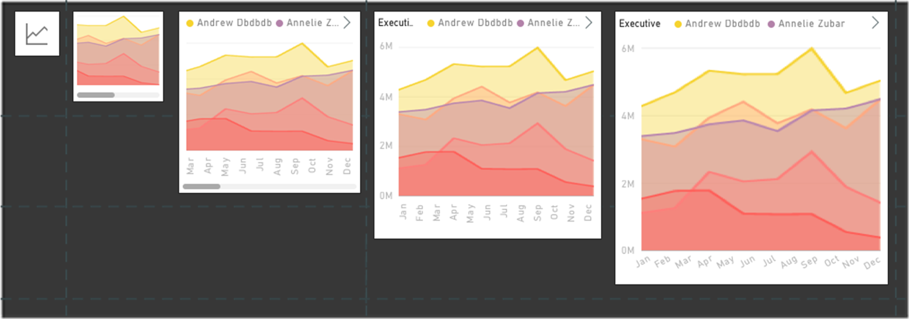

---

title: Responsive Visualization optimized for phone layout
description: Power BI is providing more ways to create experiences optimized for devices of all sizes, delivering a rich visualization on a large screen and then preserving that richness in a small screen using *responsive visualizations.
author: MargoC
manager: AnnBe
ms.date: 4/27/2018
ms.topic: article
ms.prod: 
ms.service: business-applications
ms.technology: 
ms.author: margoc
audience: Admin

---
#  Responsive Visualization optimized for phone layout

[!include[banner](../../../includes/banner.md)]

Power BI is providing more ways to create experiences optimized for devices of
all sizes, delivering a rich visualization on a large screen and then preserving
that richness in a small screen using *responsive visualizations.*

Power BI responsive visualizations dynamically change to display the maximum
amount of data and insight, no matter the screen size. As a visualization
changes its size, Power BI prioritizes the data view, for example removing
padding and legend tweaks such as moving the legend to the top of the
visualization—automatically, so the visualization remains informative and
beautiful even as it gets smaller.

A responsive visualization optimizes across Power BI platforms, whether in a
report, a dashboard, a phone report, a mobile dashboard, or even in embedded
Power BI visuals that use the Power BI API.

<!-- Picture 7 -->

*Example of responsive visualizations*
