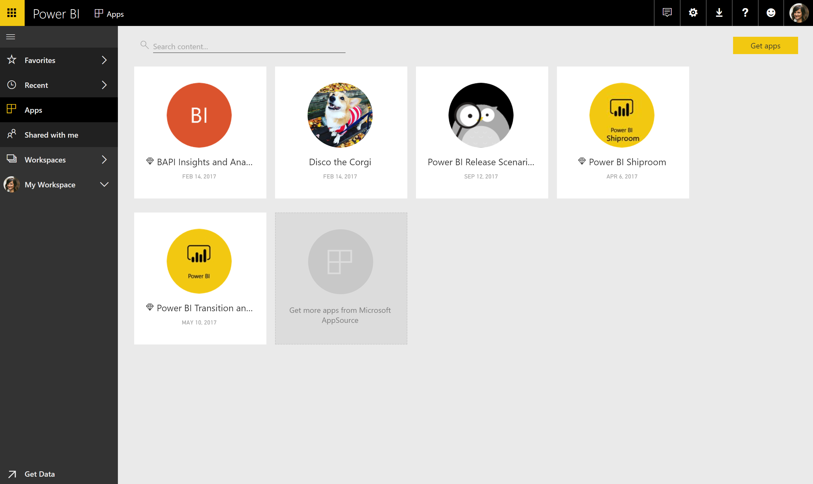

---

title: Push apps
description: You can automatically install apps that people use for work in the **Apps** content list, instead of requiring users to find the app in Microsoft AppSource or follow an installation link.
author: MargoC
manager: AnnBe
ms.date: 4/27/2018
ms.topic: article
ms.prod: 
ms.service: business-applications
ms.technology: 
ms.author: margoc
audience: Admin

---
#  Push apps

[!include[banner](../../../includes/banner.md)]

You can automatically install apps that people use for work in
the **Apps** content list, instead of requiring users to find the app in
Microsoft AppSource or follow an installation link. This streamlines roll-out of
standard Power BI content to users.

To turn on this capability, tenant admins enable Push apps to users on the
**Settings** tab in the [Power BI admin
portal](https://docs.microsoft.com/en-us/power-bi/service-admin-portal). Admins
can specify whether the entire organization or specific security groups get this
capability.

<!-- Picture 5 -->

*Push apps functionality in the admin portal*

**How to install an app automatically for users**

After an app publisher enables the Push apps setting, they need to push the app
to all users or groups defined in the **Permissions** section of the **Access**
tab. To do this, they select **Install app automatically**, and then select
**Finish**.

*Auto-install configuration setting*

**How users get the apps that were pushed to them**

After you push an app, it automatically shows up in the **Apps** list. This
helps organizations curate apps for a user or job role.

*Curated list of apps*

