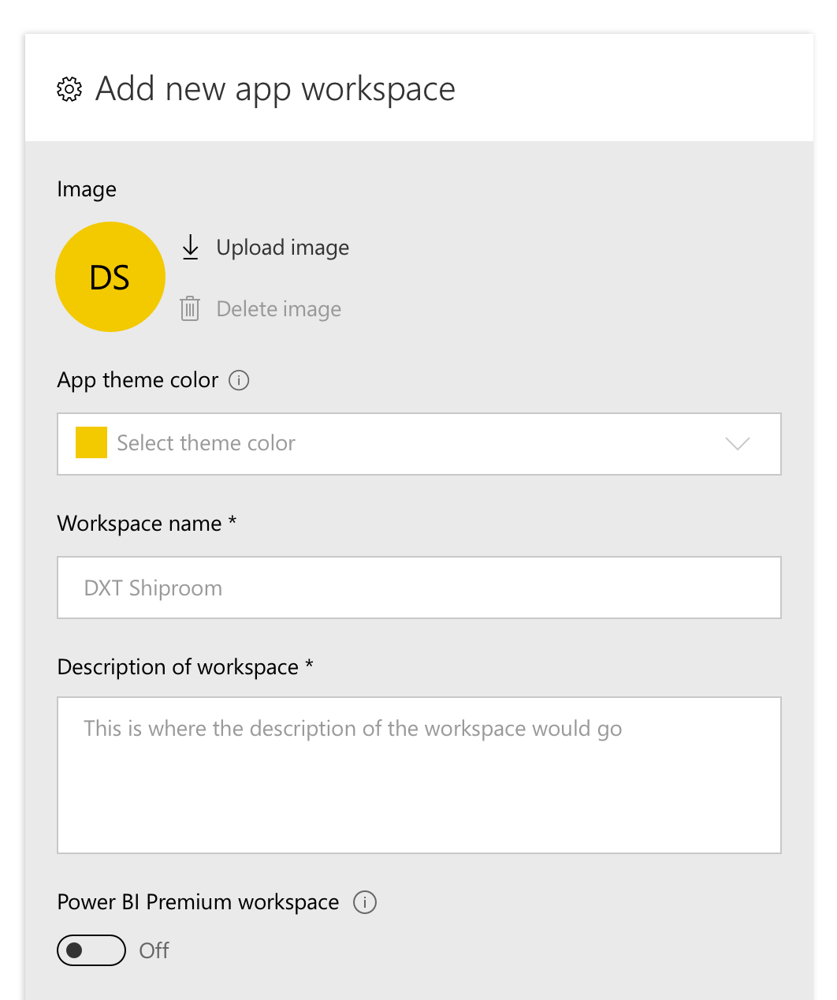

---

title: Workspaces with Azure AD groups
description: Power BI workspaces have their own roles and permissions that are separate from Office 365 groups, and which enable control over management of workspaces.
author: MargoC
manager: AnnBe
ms.date: 4/27/2018
ms.topic: article
ms.prod: 
ms.service: business-applications
ms.technology: 
ms.author: margoc
audience: Admin

---
#  Workspaces with Azure AD groups

[!include[banner](../../../includes/banner.md)]

Power BI workspaces have their own roles and permissions that are separate from
Office 365 groups, and which enable control over management of workspaces.
Capabilities include assigning workspace roles to individual users, Azure AD
security groups, and Office 365 modern groups. Additionally, governance of Power
BI workspaces is separated from governance of Office 365 modern groups.

*Add a Power BI workspace on mobile*

