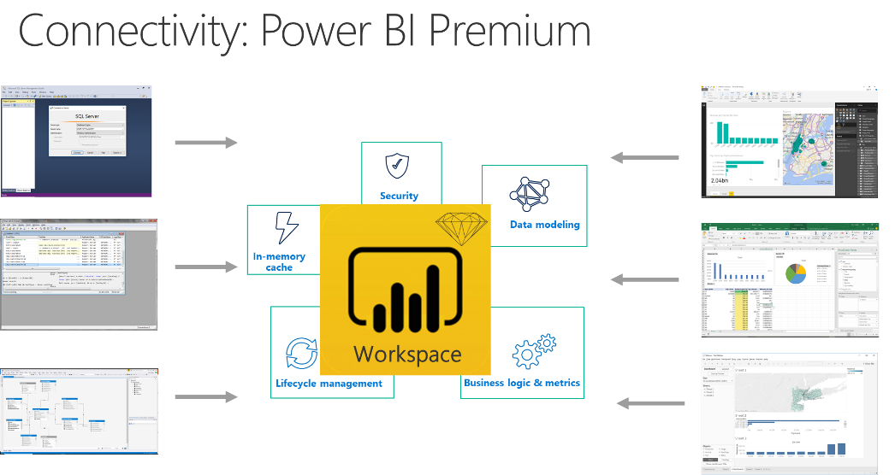

---

title: XMLA connectivity with Analysis Services
description: XMLA connectivity with Analysis Services
author: MargoC
manager: AnnBe
ms.date: 4/27/2018
ms.topic: article
ms.prod: 
ms.service: business-applications
ms.technology: 
ms.author: margoc
audience: Admin

---
#  XMLA connectivity with Analysis Services

[!include[banner](../../../includes/banner.md)]

<!-- Picture 2 -->

With this new capability, you can treat Power BI workspaces as if they were
Analysis Services servers. You’re able to connect the same tools to Power BI
premium that are currently used with Analysis Services.
