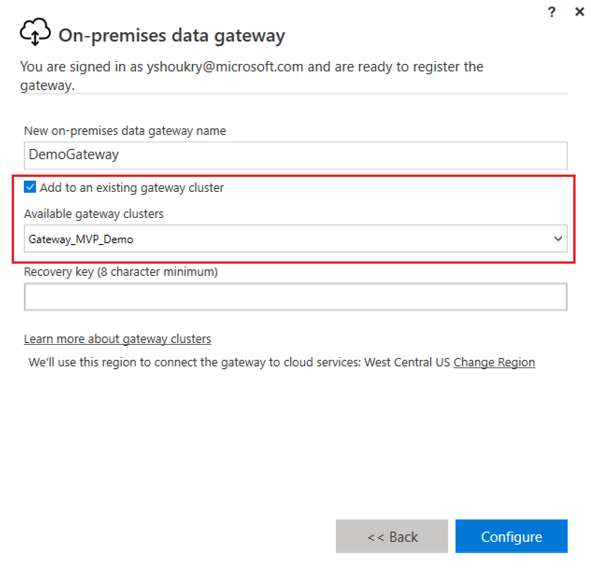

---

title: High availability and disaster recovery improvements (Public Preview)
description: High availability for the on-premises data gateway gives administrators a way to group multiple gateway instances together.
author: MargoC
manager: AnnBe
ms.date: 4/26/2018
ms.topic: article
ms.prod: 
ms.service: business-applications
ms.technology: 
ms.author: margoc
audience: Admin

---
#  High availability and disaster recovery improvements (Public Preview)

[!include[banner](../../../includes/banner.md)]

High availability for the on-premises data gateway gives administrators a way to
group multiple gateway instances together. This offers a more robust and
scalable architecture that eliminates single-point-of-failure risks.

As part of the on-premises data gateway installation, admins can specify whether
the gateway instance is added to an existing cluster or a new one. Older
gateways are exposed in their own clusters, so that users can either associate
new gateway instances with the existing ones or set up new clusters.

<!-- gateway_cluster.PNG -->

*Adding new gateways to existing clusters for high availability*
