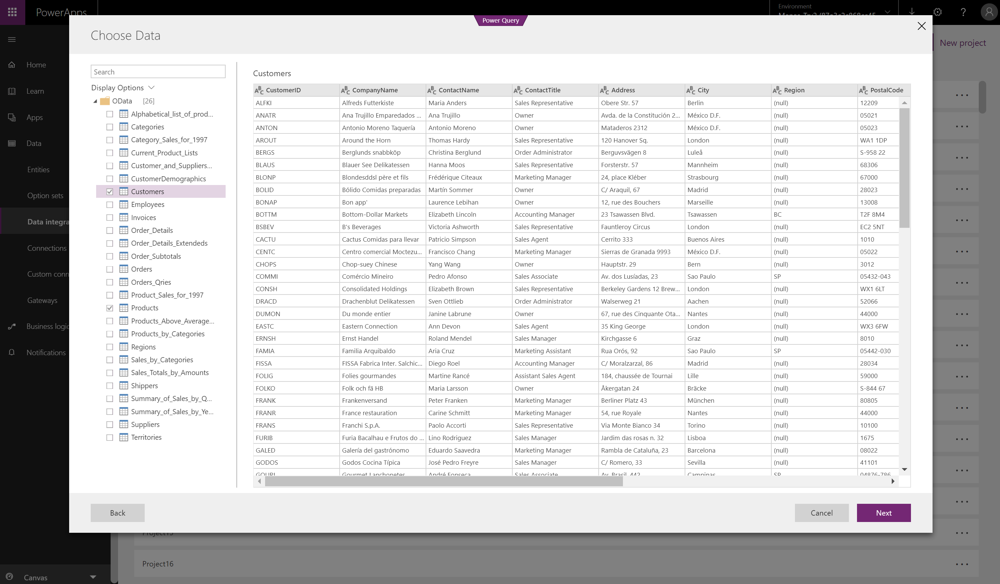
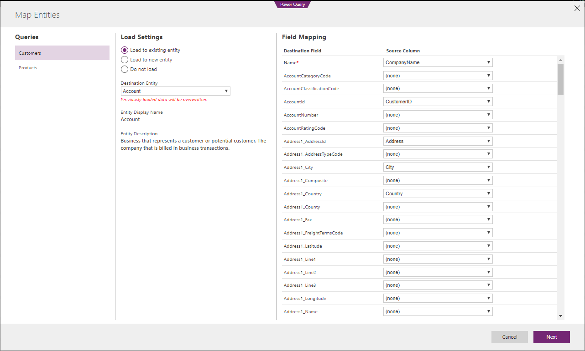

---

title: Integration with the Common Data Service for Apps and the Common Data Service for Analytics
description: Business users can load data from a wide range of data sources (including other CRM instances) into the Common Data Service for Apps and the Common Data Service for Analytics, visually map entities and fields, and, schedule data refreshes.
author: MargoC
manager: AnnBe
ms.date: 05/01/2018
ms.assetid: d22659a0-4514-4749-9757-b0926a6756df
ms.topic: article
ms.prod: 
ms.service: business-applications
ms.technology: 
ms.author: margoc
audience: Admin

---

# Integration with the Common Data Service for Apps and the Common Data Service for Analytics 

[!include[banner](../../includes/banner.md)]

Business users can load data from a wide range of data sources (including other
CRM instances) into the Common Data Service for Apps and the Common Data Service
for Analytics, visually map entities and fields, and, schedule data refreshes.
This functionality is a key enabler for customers with data-driven apps.

*Load data from a wide range of data sources*

You can specify connection settings, including the data source location,
credentials, and the installed instance of the on-premises data gateway to use
(for on-premises data sources).

*Establishing a connection*

After establishing a connection to a data source, such as an OData feed, preview
the tables included in the data source, and select one or more.

*Preview tables*

Use the Power Query editor to apply filters, transformations, and other
operations (including mashing up data from different data sources) to get the
source data into the desired shape for the Common Data Service.

*Power Query editor*

After applying data transformations, define how the query results map to Common
Data Service entities: as new entities or as existing entities.

*Map entities*

This experience for loading data into the Common Data Service with the familiar
Power Query tool is common across the Common Data Service for Apps and the
Common Data Service for Analytics.
