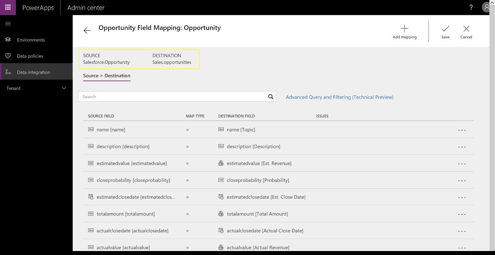

---

title: Salesforce.com template
description: With the Salesforce.
author: MargoC
manager: AnnBe
ms.date: 4/26/2018
ms.topic: article
ms.prod: 
ms.service: business-applications
ms.technology: 
ms.author: margoc
audience: Admin

---
#  Salesforce.com template

[!include[banner](../../../includes/banner.md)]

With the Salesforce.com template, you can build an app on the Common Data
Service for Apps that combines data from Salesforce.com and Dynamics 365 to
provide a 360-degree view of your business.

<!-- picture -->

*Mapping Salesforce.com Opportunity fields into the Common Data Service for
Apps*
