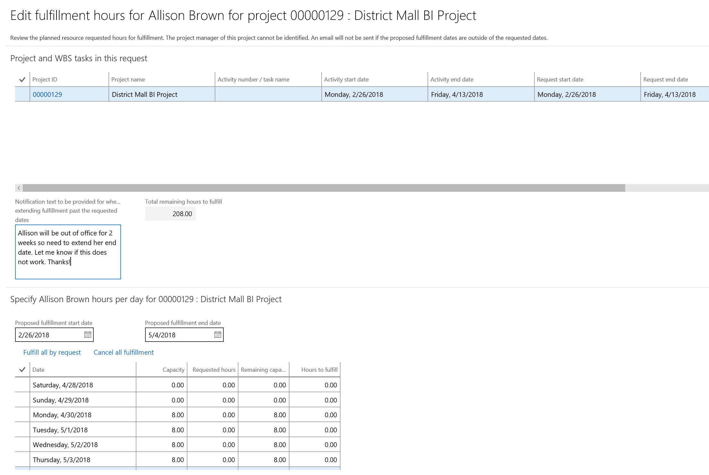

---

title: Reserve project resources past the task end date
description: Reserve project resources past the task end date
author: MargoC
manager: AnnBe
ms.date: 05/01/2018
ms.assetid: 443c327f-4128-475b-be1c-264d3b7f9b94
ms.topic: article
ms.prod: 
ms.service: business-applications
ms.technology: 
ms.author: margoc
audience: Admin

---
#  Reserve project resources past the task end date

[!include[banner](../../includes/banner.md)]

At times, the project resource manager might not have resources available to
start on a project task's start date, or the requested resource might be
unavailable for a portion of the task duration. The resource manager must be
able to fulfill resources for tasks that might extend past the planned task end
date.

This feature lets the project resource manager extend the resource reservation
past the planned task end date. The project manager is notified of the change so
that they can review the task assignments and determine the impact on the
project overall. The project manager can then either make the changes to the
project tasks or request a new resource reservation.

<!-- FO_ReservePastTaskDate_A.png -->

*Reserving a resource past the planned task end date*
