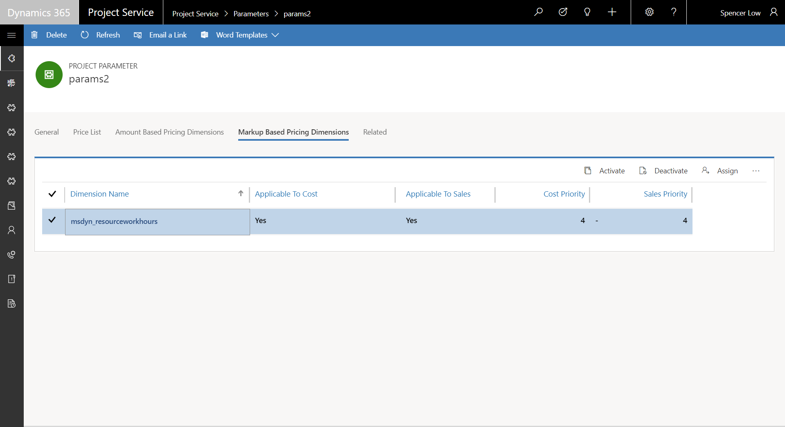
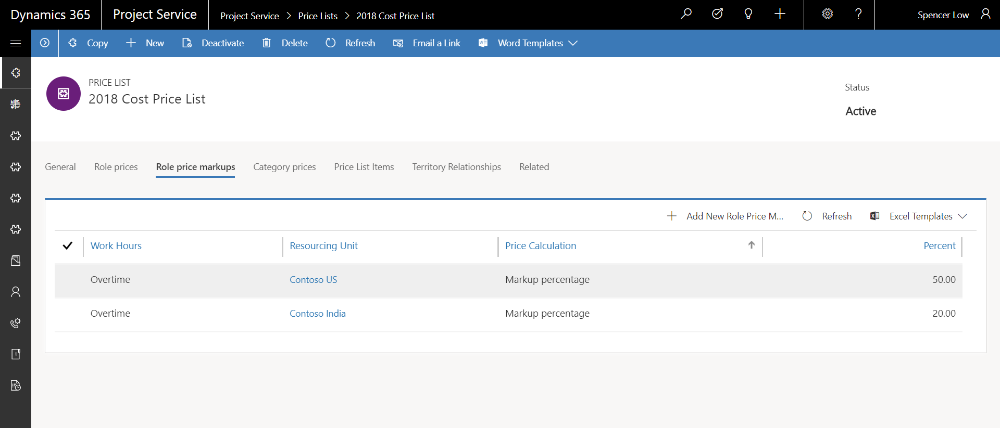
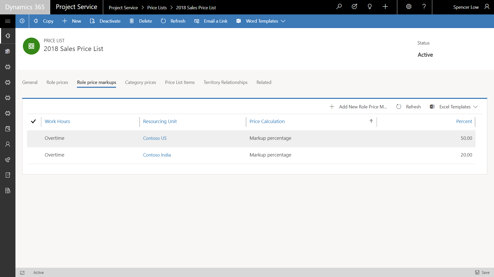

---

title: Price mark-ups and mark-downs
description: Prices can be set up as a percent-based markup on a base price, for example, to reflect overtime hours or hazardous work conditions.
author: MargoC
manager: AnnBe
ms.date: 05/01/2018
ms.assetid: f968e9e2-8ddc-4f9d-8119-90d0aea689e0
ms.topic: article
ms.prod: 
ms.service: business-applications
ms.technology: 
ms.author: margoc
audience: Admin

---
#  Price mark-ups and mark-downs 

[!include[banner](../../includes/banner.md)]

Prices can be set up as a percent-based markup on a base price, for example, to
reflect overtime hours or hazardous work conditions. This mark-up or mark-down
ties to configured pricing dimensions, such as role or resourcing unit, as
defined by the administrator. Priority-based mark-up or mark-down resolution is
also supported.

*Application of markup settings to a pricing dimension*

*Configuration of cost price markups*

*Configuration of sales price markups*
