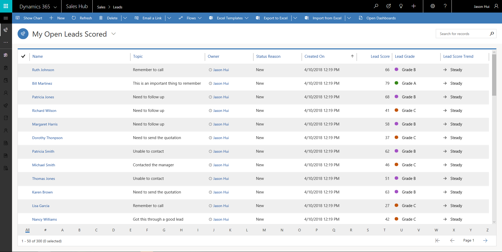

---

title: Predictive lead scoring  Public Preview 
description: Predictive lead scoring uses a predictive machine learning model to calculate a score for all open leads.
author: MargoC
manager: AnnBe
ms.date: 05/01/2018
ms.assetid: acde7d04-02bf-46d2-bfe5-bfaa2a430227
ms.topic: article
ms.prod: 
ms.service: business-applications
ms.technology: 
ms.author: margoc
audience: Admin

---
#  Predictive lead scoring (Public Preview)

[!include[banner](../../includes/banner.md)]

Predictive lead scoring uses a predictive machine learning model to calculate a
score for all open leads. The score helps salespeople prioritize leads, achieve
higher lead qualification rates, and reduce the time that it takes to qualify a
lead. The reasons behind the score add transparency to the model and help
salespeople validate the model.

The administration experience allows a business analyst to train the model and
apply it to open leads for scoring based on prediction accuracy. In addition,
when there is more data for leads or other related entities, such as accounts, a
business analyst can retrain the model and apply it to achieve more accurate
results. Plus, the business analyst can change the score ranges for lead grades
to determine lead prioritization for their business, based on qualification
rates.

<!-- Predictive lead scoring - Grid view.png -->

*Predictive lead scoring – Grid view*

<!-- Predictive lead scoring - Score and reasons widget in form.png -->

*Predictive lead scoring – Score and reasons widget in form*

<!-- Predictive lead scoring - Configuration create model.png -->

*Predictive lead scoring – Configuration create model*

<!-- Predictive lead scoring - Configuration apply model.png -->

*Predictive lead scoring – Configuration apply model*
