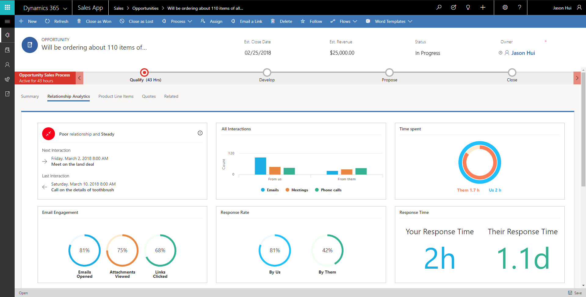

---

title: Relationship analytics  Public Preview 
description: Relationship analytics  Public Preview 
author: MargoC
manager: AnnBe
ms.date: 05/01/2018
ms.assetid: 7ed2600e-b834-40e5-94ce-e8c4b7802cbf
ms.topic: article
ms.prod: 
ms.service: business-applications
ms.technology: 
ms.author: margoc
audience: Admin

---
#  Relationship analytics (Public Preview)

[!include[banner](../../includes/banner.md)]

**Relationship analytics** helps salespeople manage the opportunities pipeline
by analyzing relationships and presenting data and insights about the health of
customer relationships. Relationship Analytics includes **sentiment analysis**
of Microsoft Office Exchange online email to enhance the relationship health
score. [For more details about the capabilities, go to the Embedded intelligence
page](https://docs.microsoft.com/en-in/dynamics365/customer-engagement/admin/embedded-intelligence).

<!-- Picture 5 -->

*Relationship analytics overview*

<!-- Picture 6 -->

*Relationship analytics dashboard*

<!-- Picture 4 -->

*Sales insights configuration for administrators*
