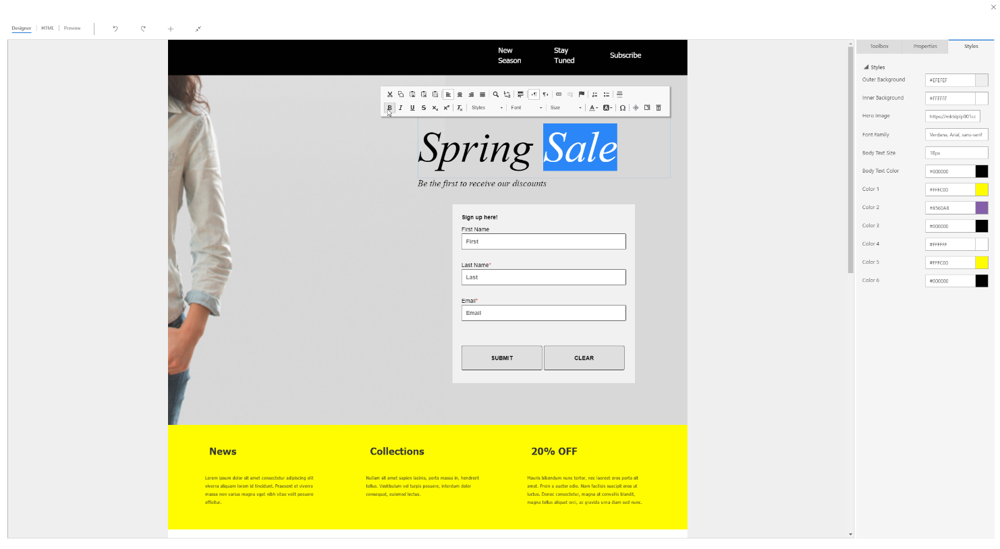

---

title: Content creation
description: Create modern online content, including visually rich email messages, landing pages, and forms using intuitive, graphical digital content designers.
author: MargoC
manager: AnnBe
ms.date: 4/27/2018
ms.topic: article
ms.prod: 
ms.service: business-applications
ms.technology: 
ms.author: margoc
audience: Admin

---
#  Content creation

[!include[banner](../../../includes/banner.md)]

Create modern online content, including visually rich email messages, landing
pages, and forms using intuitive, graphical digital content designers. Marketers
can get to work quickly by starting with professionally designed templates,
which can easily be customized and saved to help reinforce brand identity and
build brand awareness.

<!-- Marketing_ContentCreation_A.png -->

*Content designer interface*
