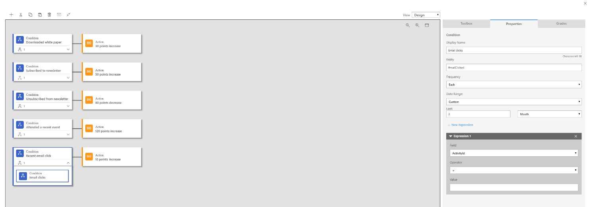

---

title: Lead management
description: Use landing pages to invite contacts to register with your organization and generate leads based on those submissions.
author: MargoC
manager: AnnBe
ms.date: 4/27/2018
ms.topic: article
ms.prod: 
ms.service: business-applications
ms.technology: 
ms.author: margoc
audience: Admin

---
#  Lead management

[!include[banner](../../../includes/banner.md)]

Use landing pages to invite contacts to register with your organization and
generate leads based on those submissions. An automated, rule-based lead scoring
engine helps identify your hottest leads as they interact with your marketing
activities, and can automatically forward sales-ready leads to salespeople when
they reach a defined score threshold. Run lead-generation campaigns on LinkedIn
and import those leads directly into Dynamics 365 for follow-up, nurturing, and
eventual qualification.

<!-- Marketing_LeadManagement_A.png -->

*Lead score model setup*

Dynamics 365 business apps share the same platform, making it possible to share
data and collaborate with sales, marketing, customer service, and other business
groups.
