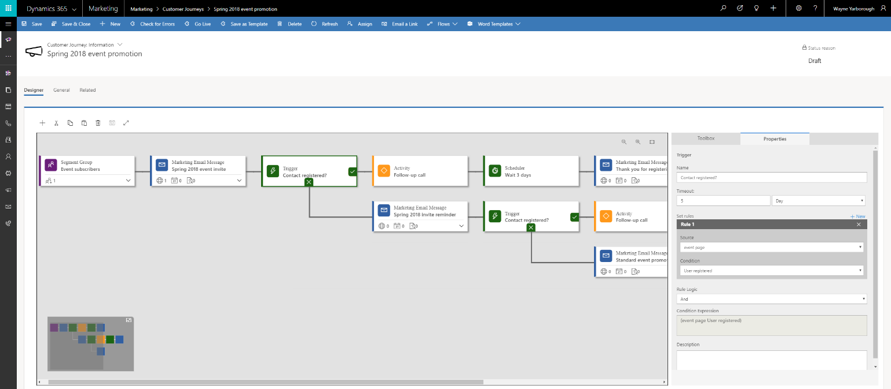

---

title: Multi-channel campaign orchestration with customer journeys
description: Create automated multichannel campaigns using the graphical and extensible customer journey designer.
author: MargoC
manager: AnnBe
ms.date: 4/27/2018
ms.topic: article
ms.prod: 
ms.service: business-applications
ms.technology: 
ms.author: margoc
audience: Admin

---
#  Multi-channel campaign orchestration with customer journeys

[!include[banner](../../../includes/banner.md)]

Create automated multichannel campaigns using the graphical and extensible
customer journey designer. Each journey establishes a target market segment and
can then deliver automated communications, make automated decisions, generate
internal tasks, deliver follow-up communications, respond to customer
interactions, and more.

<!-- Marketing_MultiChannelCampaignOrchestration_A.png -->

*Multi-channel campaign*

Run high-volume email campaigns to deliver personalized messages that look great
on all platforms and screen sizes. Judge the effectiveness of mailings with
detailed counts of opens, clicks, forwards, and more.

Use the embedded segmentation engine to set up sophisticated, dynamic marketing
segments that perfectly target your campaigns. The engine queries against a
high-volume database that uses your collected behavioral, demographic, and
firmographic data to find targeted prospects.

<!-- Marketing_MultiChannelCampaignOrchestration_B.png -->

*Segmentation flow example*
