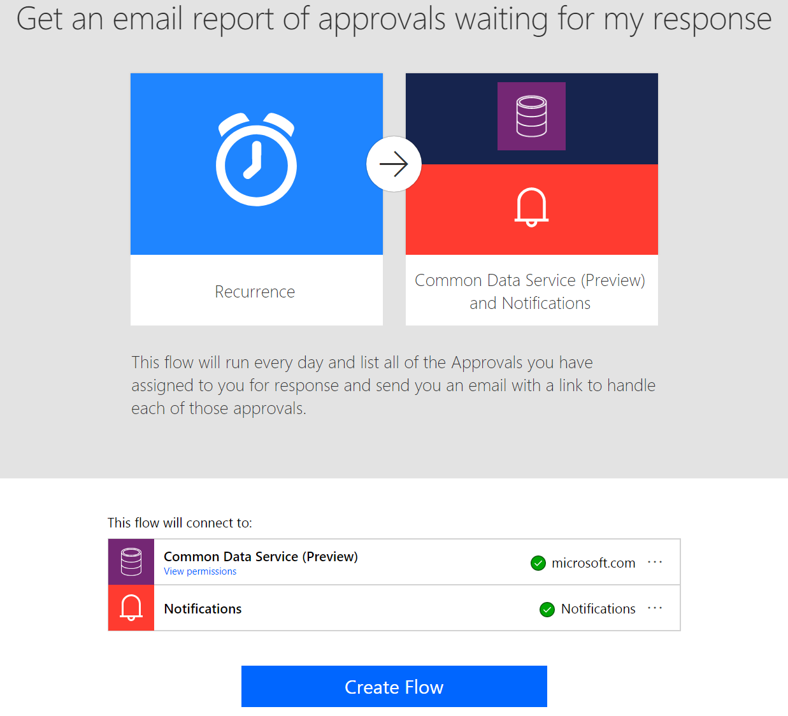

---

title: Access modern approvals in the Common Data Service for Apps
description: Modern approvals data in Flow is now built on the latest version of the Common Data Service for Apps.
author: MargoC
manager: AnnBe
ms.date: 05/01/2018
ms.assetid: c952425e-ed5f-4595-82a6-c926e6579abf
ms.topic: article
ms.prod: 
ms.service: business-applications
ms.technology: 
ms.author: margoc
audience: Admin

---
#  Access modern approvals in the Common Data Service for Apps

[!include[banner](../../includes/banner.md)]

Modern approvals data in Flow is now built on the latest version of the Common
Data Service for Apps. This means that you can build flows that read the status
of approvals you send or receive with the CDS connector. Examples include:

-   Send automatic reminders for pending approval requests.

-   Create to-do tasks in Microsoft To-Do, Trello, or Todoist when an approval
    is waiting for you.

-   Post a message to Teams when a new approval request matching specific
    parameters waiting for you.

You can [use this
template](https://flow.microsoft.com/galleries/public/templates/33d7ad77f610418d8cf3d61fe39fd507/get-an-email-report-of-approvals-waiting-for-my-response/)
as an example to start with. Customize it, and add or remove actions as needed,
such as creating a To-Do or posting to Microsoft Teams.

<!-- Picture 2 -->

*Approvals in the CDS template*

Today, all new environments created by an administrator use the latest version
of the Common Data Service for Apps. Here are a few important notes for using
this new functionality:

1.  To have Approvals installed in an environment, the administrator must first
    create an Approval flow before any other users in the environment can use
    approvals.

2.  After creation, it can take up to 10 minutes (or, in rare cases, longer) for
    Approvals to begin working in the environment.

3.  For these templates to work, the person who is using them must be assigned
    the **Common Data Service User** security role in the CDS environment.
    Otherwise, the user won’t be able to access the Approval records through the
    CDS connector. However, Approvals will continue to work as they do today,
    through the Approval center, regardless of the roles that are assigned to
    the user.

Existing environments that use Approvals will be updated with these new
capabilities in the coming weeks.
