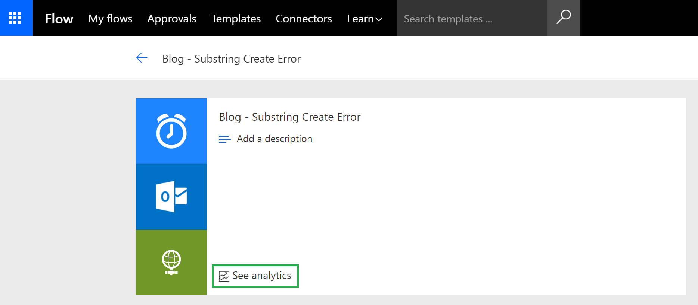

---

title: Error details analytics
description: A new embedded report that provides information about all of the errors that happen inside a flow. 
author: MargoC
manager: AnnBe
ms.date: 05/15/2018
ms.topic: article
ms.prod: 
ms.service: business-applications
ms.technology: 
ms.author: margoc
audience: Admin

---
#  Error details analytics 

[!include[banner](../../includes/banner.md)]

In December, we [announced](https://flow.microsoft.com/blog/announcing-microsoft-flow-analytics/) Microsoft Flow Analytics where we provided flow makers with the ability to visualize their run history. Starting today, we are rolling out updates to our maker analytics experience to include **Error Details**. These analytics will help users quickly identify the source and magnitude of errors they may be encountering and aid in the prompt resolution of these errors.

In this release of Microsoft Flow Analytics, we are providing the ability to view:

- Number of errors by day
- Distribution of errors by type
- Error details table

Users can access Microsoft Flow Analytics by clicking on **See analytics **link from a flow&rsquo;s main page.

Once in the analytics experience, users can click on the **Errors** tab to see the error details. From there, a user can filter data based upon a selected **Date Range**, **Action(s)**, **Trigger** or **Error Type(s)**. In addition to filtering, a user can navigate to the last occurrence of a specific error, by clicking on the **hyperlink** icon. After clicking on this link, a user will be re-directed to that specific run instance for further debugging.

**Note:** It may take up to 1.5 hours for run-time data to be loaded into our analytics experience. If instant run execution data is required, please see run details for a specific flow.

If you discover a discrepancy between the number of errors on your **Usage** tab compared to your **Errors** tab, there may be a valid reason for this including:

- If a trigger fails, you will not see it count as part of your usage as it does not represent a flow that has been successfully initiated. But, technically it is an error, so we will report it on our Errors tab.
- A flow may have multiple errors that exist within a single flow execution. For example, you may have a loop that contains multiple action(s) that have failed as part of that run instance.
- Within a flow, a maker can **Configure run after **settings, which allows a flow to continue executing when an action has failed.

Accessing Microsoft Flow Analytics requires a Flow Plan 2 license. If you do not see the **See analytics** link, appearing in the maker portal, that means that you do not meet the minimum licensing requirements. For more details about Flow licensing, including signing up for a free Flow Plan 2 trial license, please visit our [licensing page](https://flow.microsoft.com/pricing/).
