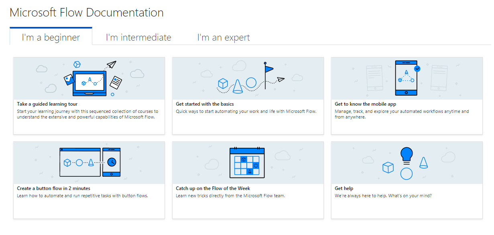

---

title: New documentation landing page
description: We always want to make it easier to learn about Microsoft Flow.
author: MargoC
manager: AnnBe
ms.date: 05/01/2018
ms.assetid: c1fb5684-8ee7-4bf5-9d92-f5a2ba24ec9b
ms.topic: article
ms.prod: 
ms.service: business-applications
ms.technology: 
ms.author: margoc
audience: Admin

---
#  New documentation landing page

[!include[banner](../../includes/banner.md)]

We always want to make it easier to learn about Microsoft Flow. There is a lot
of content out there, so we have grouped our documentation content into three
sections to help you find the right level of depth for your task:

<!-- Picture 13 -->

*New documentation page*

-   [I'm a beginner](https://docs.microsoft.com/en-us/flow/#pivot=start) -
    Covering topics such as our guided learning tour, getting to know the mobile
    app, and how to create a button flow

-   [I'm
    intermediate](https://docs.microsoft.com/en-us/flow/#pivot=intermediate) -
    Covering how to create flows from scratch and how to troubleshoot those
    flows

-   [I'm an expert](https://docs.microsoft.com/en-us/flow/#pivot=expert) -
    Covering how to work with expressions, admin features, and custom connectors
