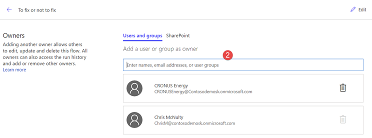

---

title: Share flows with Office 365 groups
description: You can make an Office 365 modern group the owner of a flow, and you can shared button flows with Office 365 groups so anyone in the group can run the flow.
author: MargoC
manager: AnnBe
ms.date: 05/15/2018
ms.topic: article
ms.prod: 
ms.service: business-applications
ms.technology: 
ms.author: margoc
audience: Admin

---
# Share flows with Office 365 groups

[!include[banner](../../includes/banner.md)]

Currently Flow enables you to share flows with your colleagues either by adding them as co-owners or (for manual flows only) run-only users. As co-owners, they have full edit permissions for the flow. As run-only users of manual flows, they can only run the flow. Previously, you could only add other individuals in your tenant or security groups. Now, we are enhancing these capabilities by allowing you to share all flows with Office 365 Groups. 

Suppose you have a flow that you want to share with an Office 365 Group called CRONUS Energy. From the Flow details screen, you can choose to “Add another owner” and simply enter the name or email address of the O365 Group. 

All members will be added as co-owners to the flow and can find it listed under Team flows.  You can also add Office 365 Groups as run-only users to button flows.

