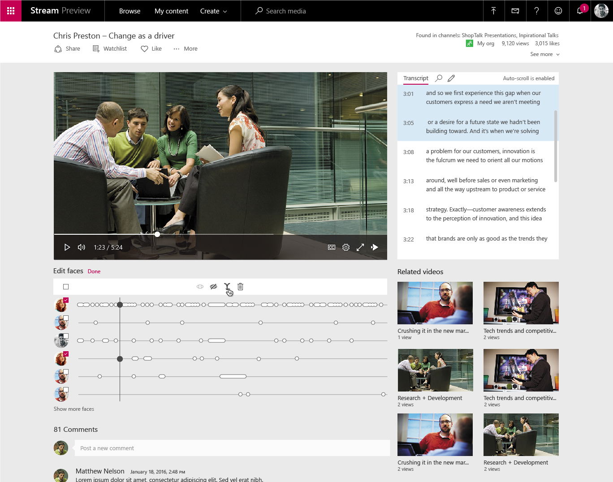

---

title: Edit transcripts and curate the people timeline
description: Microsoft Stream generates automatic transcripts for videos by using AI to convert speech to text.
author: MargoC
manager: AnnBe
ms.date: 05/01/2018
ms.assetid: 3e1a2669-a05e-4e72-a075-eba183a92647
ms.topic: article
ms.prod: 
ms.service: business-applications
ms.technology: 
ms.author: margoc
audience: Admin

---

# Edit transcripts and curate the people timeline

[!include[banner](../../includes/banner.md)]

Microsoft Stream generates automatic transcripts for videos by using AI to
convert speech to text. Automatically generated transcripts can be corrected
through inline editing.

*Transcript editor in Stream*

Microsoft Stream automatically detects the people in a video and builds a
timeline view showing where they appeared. Owners of the video can curate these
timelines by hiding extra people or merging two timelines into one with a
built-in inline editor.

*Detected faces appear in the video timeline*
