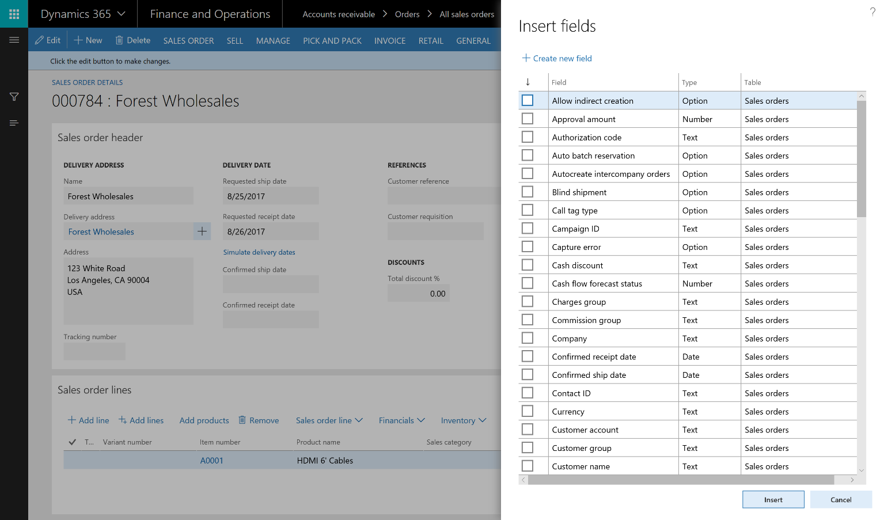
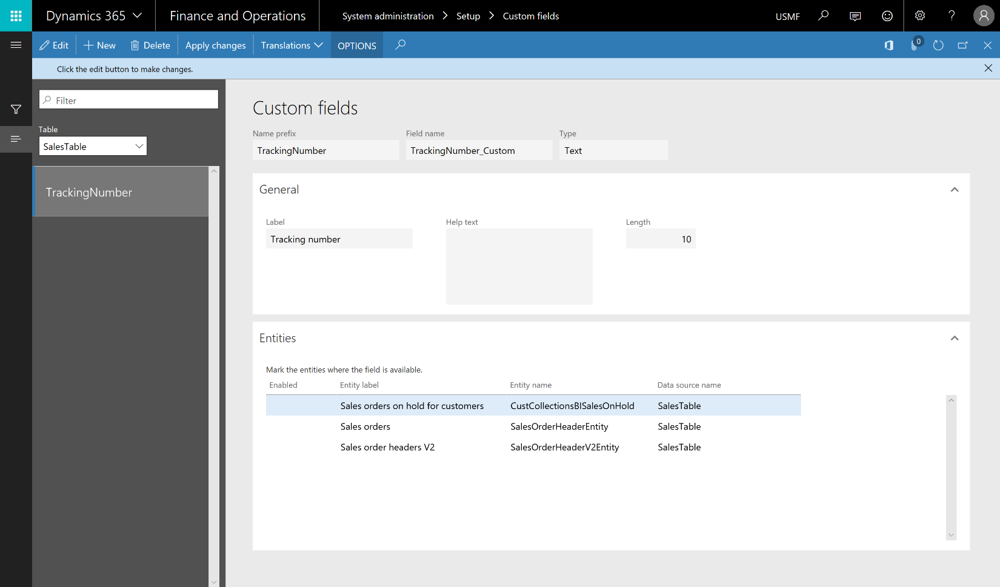

---

title: Custom fields
description: Although Finance and Operations provides an extensive set of fields out of the box for managing a broad range of business processes, customers sometimes need to track additional information in their system.
author: MargoC
manager: AnnBe
ms.date: 4/27/2018
ms.topic: article
ms.prod: 
ms.service: business-applications
ms.technology: 
ms.author: margoc
audience: Admin

---
#  Custom fields

[!include[banner](../../../includes/banner.md)]

Although Finance and Operations provides an extensive set of fields out of the
box for managing a broad range of business processes, customers sometimes need
to track additional information in their system. To accommodate this, Finance
and Operations lets you create custom fields to tailor the application to fit
your business, without coding.

<!-- FO_Adding custom fields_A.png -->

*Creating a custom field*

After you've created a custom field and exposed it on a form, a system
administrator can push a personalization to all users or a subset of users. You
can also export your personalizations, send them to one or more users, and have
each of those users import your changes. Use the Manage option on the
personalization toolbar to export and import personalizations.

<!-- FO_Adding custom fields_B.png -->

*Exporting a custom field*

You can manage custom fields using the Custom fields page in the System
administration module. This is used to:

-   View a list of all custom fields in the system.

-   Limit editing of existing custom fields.

-   Delete custom fields.

-   Expose custom fields on data entities.

-   Provide translations of custom field labels and Help text.

<!-- FO_Adding custom fields_C.png -->

*Managing custom fields*

To learn more about creating a custom field, [watch this
video](https://www.youtube.com/watch?v=gWSGZI9Vtnc) or go to the [Custom fields
documentation](https://docs.microsoft.com/en-us/dynamics365/unified-operations/fin-and-ops/get-started/user-defined-fields).
