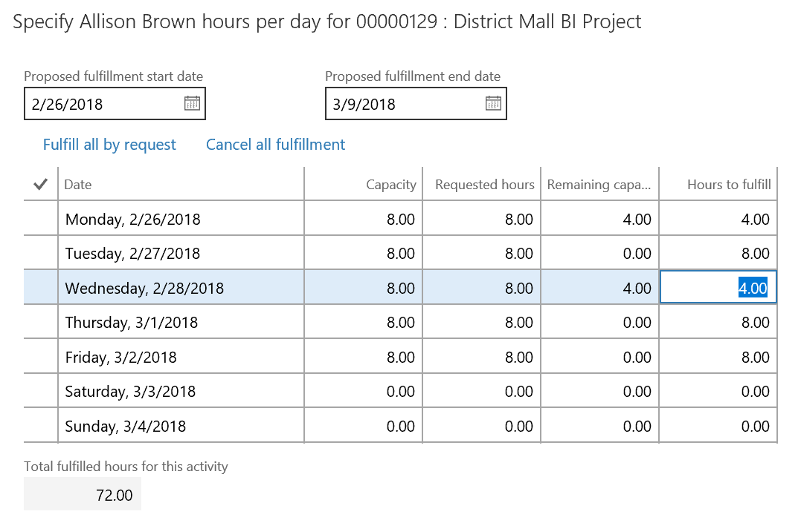

---

title: Edit default project fulfillment hours
description: The project resource manager can view and edit the default hours as part of the project booking fulfillment process.
author: MargoC
manager: AnnBe
ms.date: 4/27/2018
ms.topic: article
ms.prod: 
ms.service: business-applications
ms.technology: 
ms.author: margoc
audience: Admin

---
#  Edit default project fulfillment hours 

[!include[banner](../../../includes/banner.md)]

The project resource manager can view and edit the default hours as part of the
project booking fulfillment process. By default, the system fulfills a resource
from the start of the project over the scheduled task period. This might not
align with the true availability of the resource, and the resource manager must
be able to adjust the default fulfillment hours.

For example, if a specific task is selected to start on February 26 and is
projected to take 20 hours, the system assigns default hours for the selected
resource beginning on February 26. Typically, the hours assigned would be 8
hours on day 1, 8 hours on day 2, and 4 hours on day 3. Assume that the selected
resource was finishing another project and was allocated on that project for 4
hours on February 26. Based on the default hours assigned to the resource, the
resource would be overbooked on day 1 (12 hours). The resource manager can edit
the assigned hours and change them to 4 hours (total of 8 hours across both
projects) on the first day and 8 hours on the third day. The resource manager
can also potentially choose to schedule days 2 and 3 at 10 hours each, and day 1
at 0 hours for the project task (all within the task schedule period).

<!-- FO_EditFullfilment_A.png -->

*Edit default project fulfillment hours*
