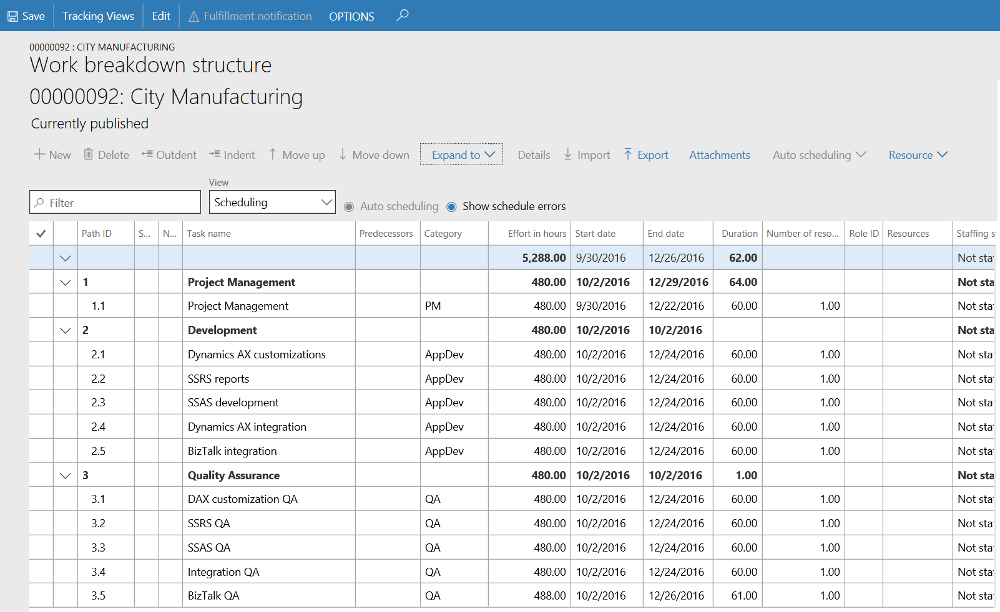
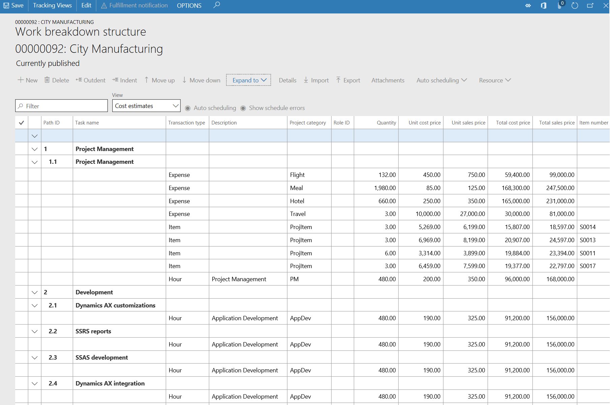

---

title: Extensible project work breakdown structure
description: The current hierarchal grid control used for the project work breakdown structure is being deprecated and replaced with a standard grid that is enhanced to support hierarchical data.
author: MargoC
manager: AnnBe
ms.date: 4/27/2018
ms.topic: article
ms.prod: 
ms.service: business-applications
ms.technology: 
ms.author: margoc
audience: Admin

---
#  Extensible project work breakdown structure

[!include[banner](../../../includes/banner.md)]

The current hierarchal grid control used for the project work breakdown
structure is being deprecated and replaced with a standard grid that is enhanced
to support hierarchical data. This change will let you use extensions to
customize the project work breakdown structure. This feature is available with
the May 2018 application update.

<!-- ProjectManagementAndAccounting_ExtensibleProjectWBS_SchedulingView.png -->

*Work breakdown structure - scheduling view*

<!-- ProjectManagementAndAccounting_ExtensibleProjectWBS_CostEstimatesView.png -->

*Work breakdown structure – cost estimates view*
