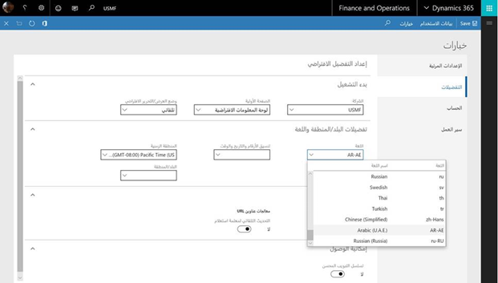

---

title: Globalization – United Arab Emirates localization for Fall 2017 release (version 7.3 update)
description: Dynamics 365 for Finance and Operations Fall 2017 release (version 7.
author: MargoC
manager: AnnBe
ms.date: 4/27/2018
ms.topic: article
ms.prod: 
ms.service: business-applications
ms.technology: 
ms.author: margoc
audience: Admin

---
#  Globalization – United Arab Emirates localization for Fall 2017 release (version 7.3 update)

[!include[banner](../../../includes/banner.md)]

Dynamics 365 for Finance and Operations Fall 2017 release (version 7.3) has been
updated with support of mandatory regulatory requirements in tax area for United
Arab Emirates (UAE). The UAE localization functionality includes:

-   Electronic VAT return declaration

-   Electronic FAF audit file

-   VAT reverse charge functionality

-   Sales invoice printout report localization accordingly to UAE requirements

-   User interface new language Arabic for United Arab Emirates

<!-- picture -->

*User interface in Arabic (UAE) language*
