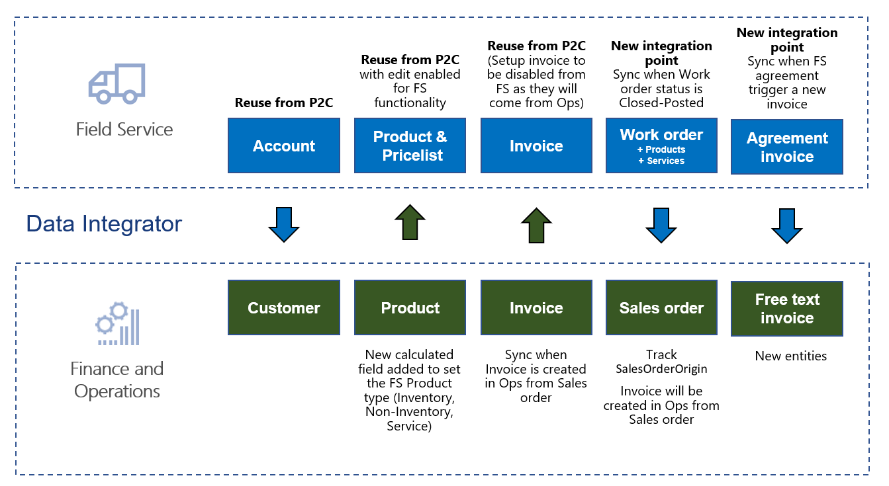
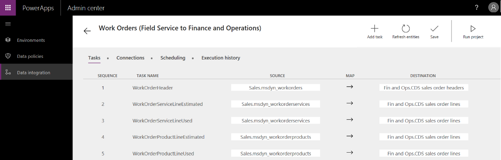

---

title: Integration with Dynamics 365 for Field Service
description: Data integration supports scenarios where Field Service activities are done outside Finance and Operations.
author: MargoC
manager: AnnBe
ms.date: 4/27/2018
ms.topic: article
ms.prod: 
ms.service: business-applications
ms.technology: 
ms.author: margoc
audience: Admin

---
#  Integration with Dynamics 365 for Field Service

[!include[banner](../../../includes/banner.md)]

Data integration supports scenarios where Field Service activities are done
outside Finance and Operations. Functionality includes: 

-   Enabling invoicing of Dynamics 365 for Field Service work orders and
    agreements in Finance and Operations.

-   Integration of warehouse information with on-hand inventory, item
    reservations, usage, adjustments, and transfers. 

-   Support for purchase order integration with synchronization of vendors,
    purchase orders, and receipts.

The first phase of feature work focuses on enabling invoicing of Field Service
work orders and agreements in Finance and Operations. The supported flow starts
in Field Service, where information from work orders is synchronized to Finance
and Operations as sales orders. In Finance and Operations, the sales orders are
invoiced to generate invoice documents. In addition, the information from Field
Service agreement invoices is synchronized to Finance and Operations.

The Dynamics 365 data integrator synchronizes data by using customizable
projects. Standard templates can be used to create custom integration projects,
where additional standard and custom fields, and also entities, can be mapped to
adjust the integration and meet specific needs.

<!-- FO_field_service_integration_B.png -->

*Field Service and Finance and Operations integrations*

In the first phase, templates are provided for integration from Field Service to
Finance and Operations for the following entities:

-   Products, including Field Service Product Type information

-   Work orders to sales orders

-   Agreements invoices to free text invoices

<!-- FO_field_service_integration_A.png -->

*Work orders to sales orders integration*

In addition to the templates listed earlier, the previously released templates
and functionality for Prospect to cash integration can be used to synchronize:

-   Accounts to Customers.

-   Invoices.

<!-- Picture 1 -->

*Prospect to cash data flow*

To learn more about the Prospect to cash integration, [watch this
video](https://youtu.be/AVV9x5x-XCg) or go to the [Prospect to cash
documentation](https://docs.microsoft.com/en-us/dynamics365/unified-operations/supply-chain/sales-marketing/prospect-to-cash).
