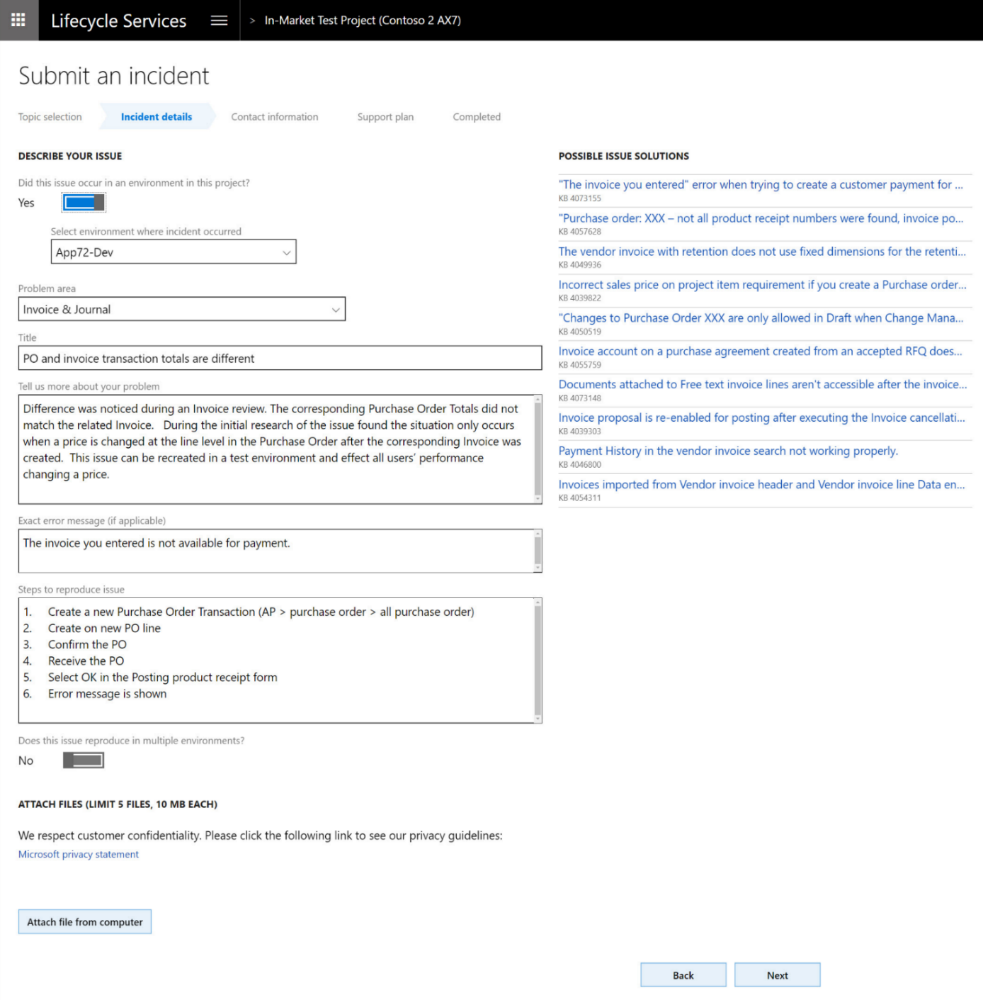

---

title: KB recommendations when entering a support case
description: When a user creates a support case, the LCS support workflow populates possible issue solutions in Issue Search based on the user's selection and input, and dynamically refreshes these results as the user provides more details.
author: MargoC
manager: AnnBe
ms.date: 4/27/2018
ms.topic: article
ms.prod: 
ms.service: business-applications
ms.technology: 
ms.author: margoc
audience: Admin

---
#  KB recommendations when entering a support case

[!include[banner](../../../includes/banner.md)]

When a user creates a support case, the LCS support workflow populates possible
issue solutions in Issue Search based on the user's selection and input, and
dynamically refreshes these results as the user provides more details. This
feature uses Azure Search to extract and collect data to use as search criteria,
filter relevant KB results to the correct product version and environment, and
provide an interactive, continuous, context-based support experience. The result
is a smarter Issue Search that continuously refines search results based on the
user’s input. Therefore, it provides more relevant search results and better
solutions, thereby reducing the need for users to submit cases by helping them
find existing solutions.

<!-- FO_KB recommendations when entering a support case_A.png -->

*KB recommendations when entering a support case*

