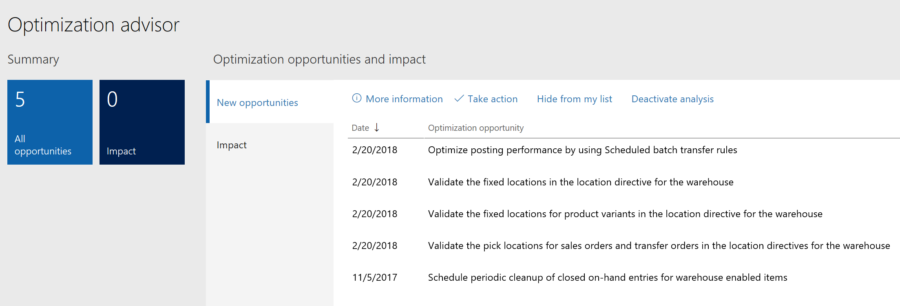

---

title: Optimization advisor
description: Optimization advisor provides added visibility and intelligence in your business operations to improve efficiency.
author: MargoC
manager: AnnBe
ms.date: 4/27/2018
ms.topic: article
ms.prod: 
ms.service: business-applications
ms.technology: 
ms.author: margoc
audience: Admin

---
#  Optimization advisor

[!include[banner](../../../includes/banner.md)]

Optimization advisor provides added visibility and intelligence in your business
operations to improve efficiency. This system, which is available to business
users, uses telemetry to analyze your business processes, find optimization
opportunities, use application data to quantify the opportunities, and then
recommend solutions.

In this release, Optimization advisor rules analyze the:

-   Performance of inventory closing.

-   Performance of wave processing and work creation within warehouse
    management.

-   Overall performance of the application. Optimization advisor then recommends
    changes to system configuration settings to improve the performance of the
    business processes in use.

-   Master data quality across bills of materials, routes, and inventory
    management.

-   Ability to unlock a financial journal that is locked by the system.

<!-- FO_Optimization_Advisor_B.PNG -->

*Optimization opportunities*

After running a business process, a notification appears in the Action center. A
user opens the notification and is directed to opportunities in the Optimization
advisor workspace. The user reviews the list of opportunities and then decides
whether to take the recommended action. The system automates the action to be
taken, if possible, or takes the user to the appropriate location, if manual
steps are needed. If the action isn't appropriate for the business, the user can
either hide the opportunity or deactivate the analysis. Organizations can also
create new Optimization advisor rules for their businesses.

In the following example, an inefficient route runtime was detected in a
warehouse because the route runtime varied from the system's average runtime.

<!-- FO_Optimization_advisor_A.png -->

*Optimization advisor recommendation*

To learn more about Optimization advisor, [watch this
video](https://youtu.be/MRsAzgFCUSQ) or go to the [Optimization advisor
documentation](https://docs.microsoft.com/en-us/dynamics365/unified-operations/dev-itpro/sysadmin/optimization-advisor).
