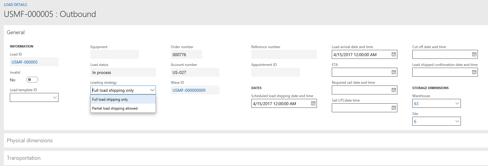

---

title: Partial shipment of a load (split load)
description: This functionality supports scenarios where load planning from a transportation department can’t affect loads that are planned for a single truck or a specific outbound transport capacity.
author: MargoC
manager: AnnBe
ms.date: 4/27/2018
ms.topic: article
ms.prod: 
ms.service: business-applications
ms.technology: 
ms.author: margoc
audience: Admin

---
#  Partial shipment of a load (split load)

[!include[banner](../../../includes/banner.md)]

This functionality supports scenarios where load planning from a transportation
department can’t affect loads that are planned for a single truck or a specific
outbound transport capacity. With this functionality, it's no longer necessary
to wait for the transport trucks or other capacity to arrive to create the
planning load. This feature lets customers designate a single load or multiple
loads to be fully or partially loaded. The feature is integrated with
appointment scheduling.

<!-- FO_partial_shipment_of-a_load_A.png -->

*Partial shipment of a load*
