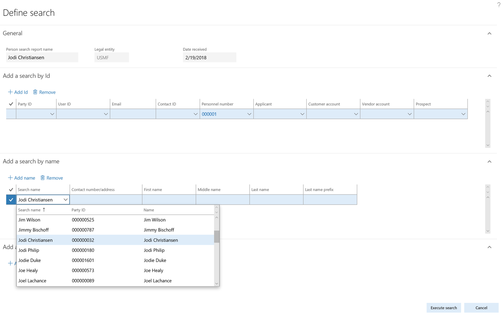

---

title: Person search report
description: The Person search report lets you find a person and their personal data in Finance and Operations.
author: MargoC
manager: AnnBe
ms.date: 4/27/2018
ms.topic: article
ms.prod: 
ms.service: business-applications
ms.technology: 
ms.author: margoc
audience: Admin

---
#  Person search report

[!include[banner](../../../includes/banner.md)]

The Person search report lets you find a person and their personal data in
Finance and Operations. (The report is also available for Dynamics 365 for
Talent and Dynamics 365 for Retail.) By using the Finance and Operations data
management framework and a pre-packaged set of entities, you can generate a
report and export personal data for a specified person. The data can be exported
in a choice of formats, including Excel worksheets.

A person might be a customer, a vendor, an applicant, a truck driver, or an
employee. When using the Person search report, you can specify data that lets
you easily identify those roles and extract the data in a single report.

The report can provide value in a number of situations. It's possible for a
single person to be entered in Finance and Operations more than once. For
example, someone named Jodi Christiansen might be listed in the address book by
the name “Jodi Christiansen” and by using initials, such as “J. R.
Christiansen.” The Person search report lets you specify each instance of a
person and include them on a single report. The report can also be used in
response to a request for personal data under the General Data Protection
Regulation (GDPR).

To use the Person search report:

1.  From the System administration menu, open the Person search list page, and
    create a new search.

2.  Name the project “Jodi Christiansen.”

<!-- FO_Person_Search_Report_A.png -->

Person search report

1.  The search gives you three options: you can search by ID, by name, or by
    address. In this example, you would search by ID, so that the report will
    return instances of each name that is associated with the ID you entered.

2.  Run the search to show the results.

3.  Verify that the results are valid. Clear any selections that return
    information you don't want to include on the report.

4.  Select Process report, and then select the Person search template.

5.  Select OK. A data package is generated.

6.  When the package has been generated, export it to your selected data format.
