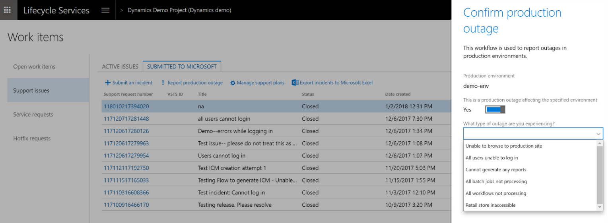

---

title: Report production outage
description: This feature is available to customers who have purchased Finance and Operations and who have implementation projects that have a production environment deployed in LCS.
author: MargoC
manager: AnnBe
ms.date: 4/27/2018
ms.topic: article
ms.prod: 
ms.service: business-applications
ms.technology: 
ms.author: margoc
audience: Admin

---
#  Report production outage

[!include[banner](../../../includes/banner.md)]

This feature is available to customers who have purchased Finance and Operations
and who have implementation projects that have a production environment deployed
in LCS. It provides a quick and effective channel to escalate issues to
Microsoft Support if the services in a production environment are degraded or
become unavailable. A production outage can be defined as one or more
system-wide issues on a live production environment that affect multiple users
and prevent your business from performing daily operations.

The reporting flow is as follows:

1.  In a live production environment, a customer experiences an outage or other
    situation that prevents business from continuing.

2.  The customer reports a production outage issue by using the LCS Support
    portal.

3.  The customer selects a production outage issue and provides additional
    information.

4.  A Microsoft support engineer acknowledges the production outage ticket
    within 30 minutes of submission and begins to immediately collaborate with
    stakeholders to investigate and resolve the issue.

5.  A support engineer contacts the customer to provide a status update.

<!-- FO_Report production outage_D.png -->

*Report production outage*

<!-- FO_Report production outage_B.png -->

*Confirming a production outage*
