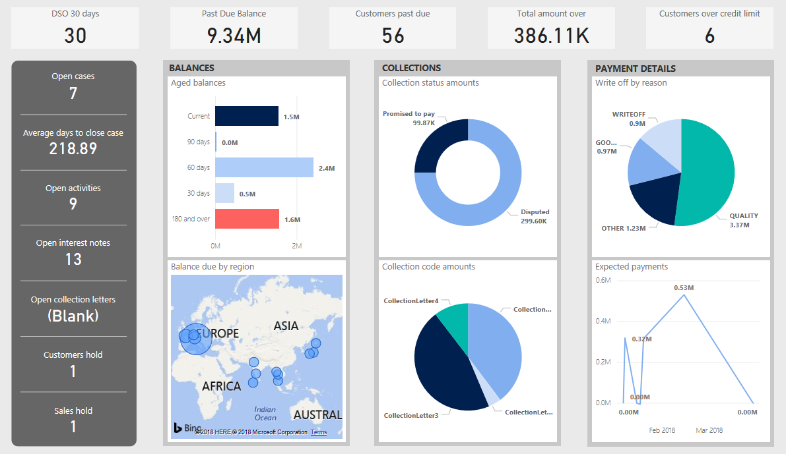
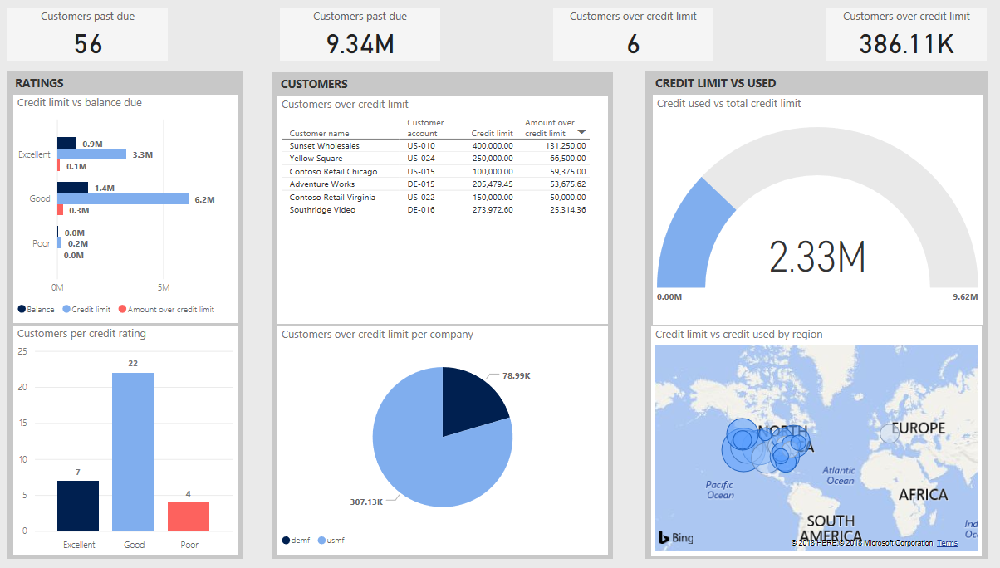

---

title: Credit and collections overview
description: Credit and collections overview
author: MargoC
manager: AnnBe
ms.date: 4/27/2018
ms.topic: article
ms.prod: 
ms.service: business-applications
ms.technology: 
ms.author: margoc
audience: Admin

---
#  Credit and collections overview

[!include[banner](../../../includes/banner.md)]

>   **Availability**

>   Public Preview of Credit and collections is available in  
>   all regions where Dynamics 365 for Finance and Operations is available.

>   For a complete list of regions, see the [Dynamics 365 International
>   Availability
>   Guide](https://aka.ms/dynamics_365_international_availability_deck).

In addition to historical trends and analysis, you can leverage predictive
analysis and built-in visuals to proactively show and identify trends. By
experimenting with the visuals, you can see emerging trends and key groups of
customers and credit.

The Credit and collections insights capabilities are available as part of a
workspace within Dynamics 365 for Finance and Operations, and also in a
stand-alone app, which is available at <https://appsource.microsoft.com>.

<!-- FO_Credit_and_collections_a.png -->

*Credit and collections*

<!-- FO_credit_and_collections_b.png -->

*Credit and collections*
