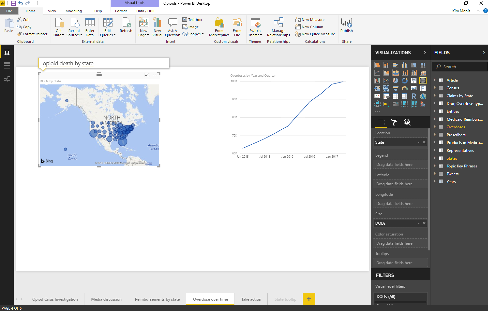

---

title: Ask Top N questions in Q A
description: Ask Top N questions in Q A
author: MargoC
manager: AnnBe
ms.date: 05/01/2018
ms.assetid: 81d127c8-21e8-4e30-b844-c7bcfdc7b902
ms.topic: article
ms.prod: 
ms.service: business-applications
ms.technology: 
ms.author: margoc
audience: Admin

---
#  Ask Top N questions in Q&A

[!include[banner](../../../includes/banner.md)]

Use ad hoc analysis in Q&A to ask Top N questions, such as “What are my top 10
customers by sales?” Users can ask these questions in Power BI Desktop when
authoring a visual, in the Power BI Service while viewing a dashboard, or on
mobile using voice.

*Example of a question-based query on a dashboard*

