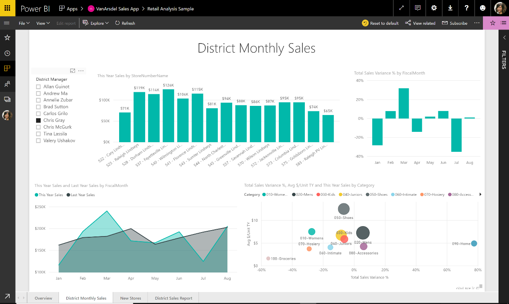

---

title: Persistent filters
description: Persistent filters
author: MargoC
manager: AnnBe
ms.date: 05/01/2018
ms.assetid: c940dc31-464e-44ee-a322-061493b21b64
ms.topic: article
ms.prod: 
ms.service: business-applications
ms.technology: 
ms.author: margoc
audience: Admin

---
#  Persistent filters

[!include[banner](../../../includes/banner.md)]

Power BI persistent filters save users’ slicer and filter values, and
automatically applies them when users return to view the reports. Users can
reset filters back to the default setting.

*Filters on a report*

