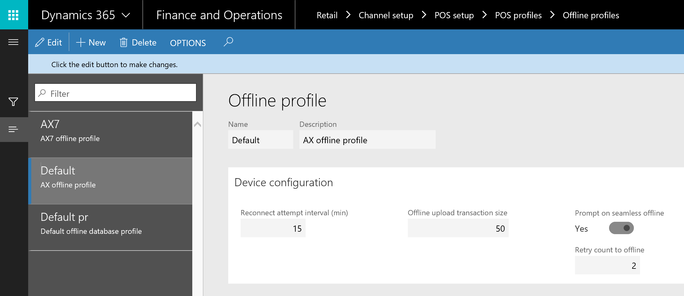
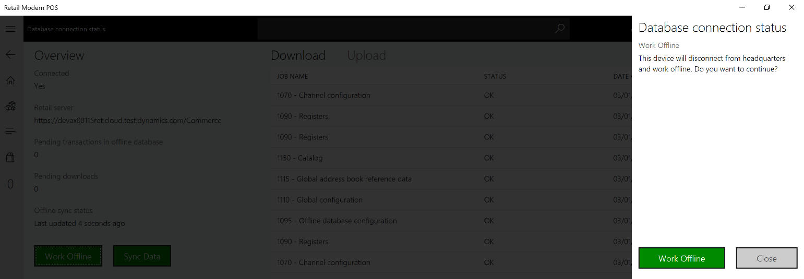

---

title: CDX and data management
description: Retail organizations often find it challenging to maintain connectivity everywhere at all times.
author: MargoC
manager: AnnBe
ms.date: 4/27/2018
ms.topic: article
ms.prod: 
ms.service: business-applications
ms.technology: 
ms.author: margoc
audience: Admin

---
#  CDX and data management

[!include[banner](../../../includes/banner.md)]

Retail organizations often find it challenging to maintain connectivity
everywhere at all times. It can be a disruptive and daunting task to manage and
maintain full connectivity without downtime. By allowing for offline
functionality that is seamless and simple to administer, retail organizations’
point of sale terminals can continue to function during software updates or
internet disconnects. To facilitate easy and informative workflows, the user
interface and logic around when to switch between an online connectivity and an
offline functionality has been enhanced to make it clear what is occurring and
how to best handle any changes to the work being done.

On the Offline profile page, retail organizations can configure what happens
when the point of sale terminal switches to offline functionality.

<!-- Retail_CDX_A.png -->

*Configuring offline functionality*

On the point of sale device, users can view the status of their connection to
the database and choose to work offline, if required.

<!-- Retail_CDX_B.png -->

*Viewing connected status of POS*

Based on configuration settings, users can be prompted when offline operation is
triggered.

<!-- Retail_CDX_C.png -->

*Confirming offline functionality*
