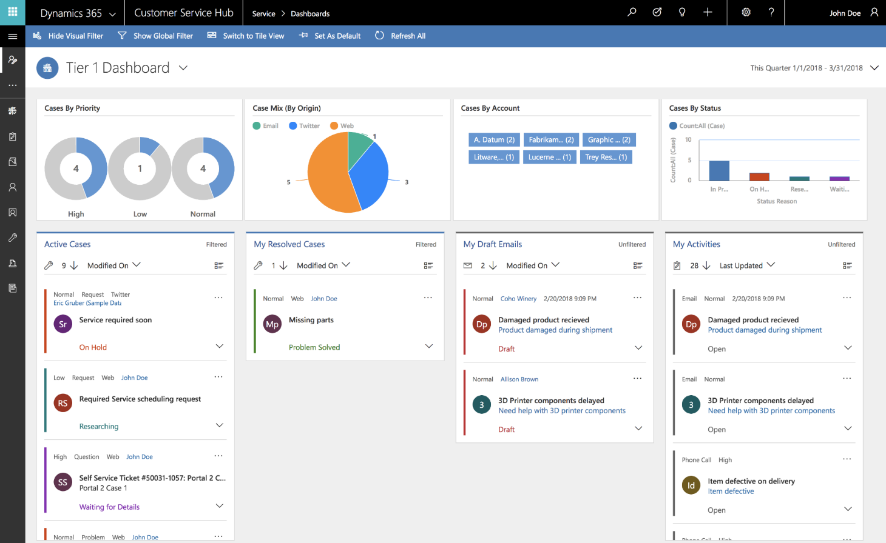

---

title: Interactive dashboards
description: Customer Service Hub dashboards are a one-stop workplace where agents and supervisors review their workload and take actions to resolve issues.
author: MargoC
manager: AnnBe
ms.date: 4/27/2018
ms.topic: article
ms.prod: 
ms.service: business-applications
ms.technology: 
ms.author: margoc
audience: Admin

---
#  Interactive dashboards

[!include[banner](../../../../includes/banner.md)]

Customer Service Hub dashboards are a one-stop workplace where agents and
supervisors review their workload and take actions to resolve issues. Dashboards
make it easier to review and act on information coming from various entity views
and queues, and make it easier to apply additional filtering with visual,
global, and timeframe filters to quickly narrow down what is most actionable and
urgent.

##### Tier 1 dashboard for agents

The Tier 1 multi-stream dashboard is displayed by default. The Tier 1 dashboard
is tailored to help agents deliver the initial level of support needed, and
handle multiple customer issues at the same time. 

<!-- picture -->

*Tier 1 dashboard for service agents*

##### Tier 2 dashboard for service managers or Tier 2 agents

The Tier 2 single-stream dashboard helps customer service managers and Tier 2
agents monitor more complex or escalated cases in a single view. 

<!-- picture -->

*Tier 2 dashboard for service managers and Tier 2 agents*

