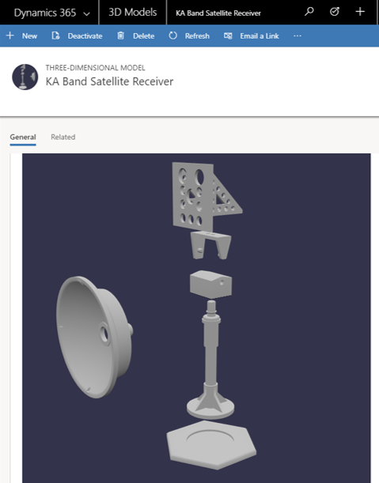

---

title: Associate 3D content with customer asset records
description: Arm your technicians with 3D content to help them complete repairs.
author: MargoC
manager: AnnBe
ms.date: 4/27/2018
ms.topic: article
ms.prod: 
ms.service: business-applications
ms.technology: 
ms.author: margoc
audience: Admin

---
#  Associate 3D content with customer asset records

[!include[banner](../../../../includes/banner.md)]

Arm your technicians with 3D content to help them complete repairs. 3D models or
sequences can be uploaded (directly to Dynamics 365 or hosted externally), and
then associated with customer asset records for use by technicians within the
mobile app. Supported 3D file formats are glTF, GLB, and OBJ.

<!-- FS_NASA3DPhoto.png -->

*3D model image used with permission from NASA*
