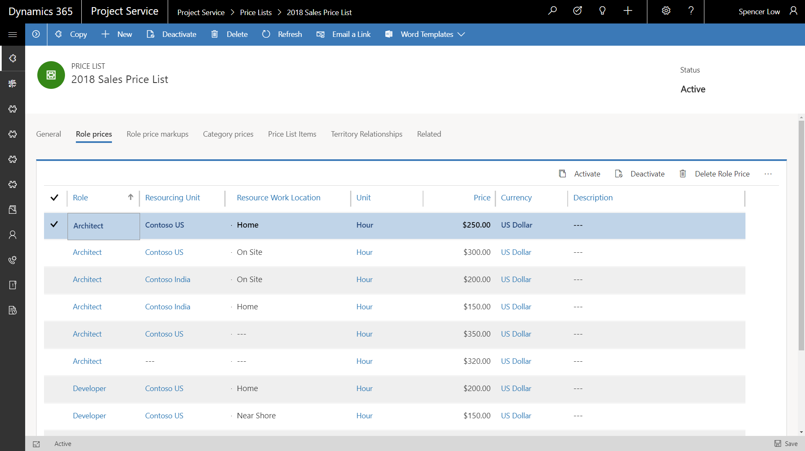

---

title: Custom pricing dimensions for resource pricing
description: To maximize flexibility to meet different business requirements, the updated Project Service solution supports discrete application of pricing dimension sets to cost and bill rates.
author: MargoC
manager: AnnBe
ms.date: 4/27/2018
ms.topic: article
ms.prod: 
ms.service: business-applications
ms.technology: 
ms.author: margoc
audience: Admin

---
#  Custom pricing dimensions for resource pricing

[!include[banner](../../../../includes/banner.md)]

To maximize flexibility to meet different business requirements, the updated
Project Service solution supports discrete application of pricing dimension sets
to cost and bill rates. Dimension values can be set as the default and
propagated across the costing and pricing process from resource profiling to
time entry to project actuals. Customer-specific configuration and modification
or extension leverages standard Dynamics 365 customizability infrastructure.

*Selection and prioritization of dimensions that drive cost and sales prices*

*Sample price list with custom fields for standard title and work location used
as pricing dimensions*

*Sample price list with role, resource unit, and work location as pricing
dimensions*
