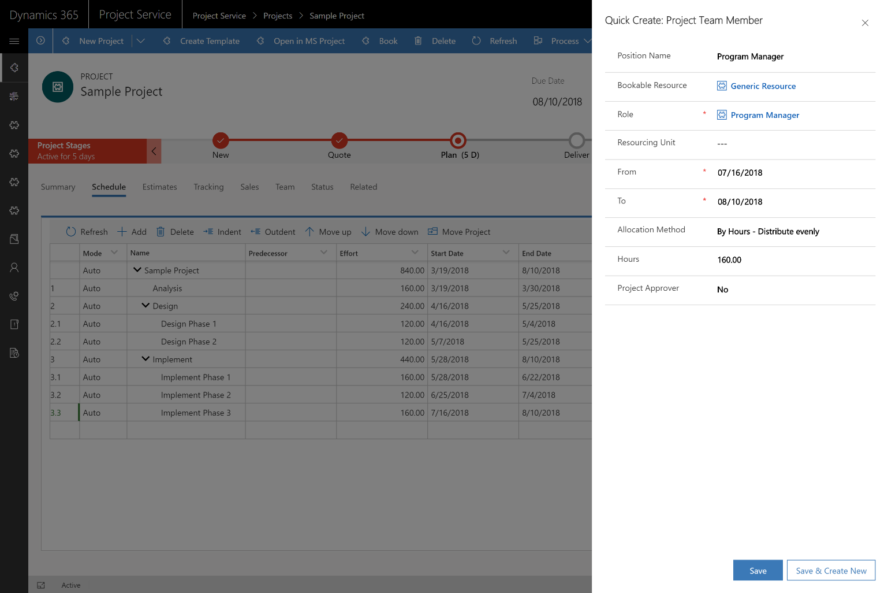

---

title: Work breakdown structure (WBS) editable grid with Gantt visualization
description: The Spring '18 release introduces an editable grid with a Gantt visualization experience for the work breakdown structure (WBS), and removes the restriction that requires upfront booking of named resources to the project team before assigning them to tasks.
author: MargoC
manager: AnnBe
ms.date: 4/27/2018
ms.topic: article
ms.prod: 
ms.service: business-applications
ms.technology: 
ms.author: margoc
audience: Admin

---
#  Work breakdown structure (WBS) editable grid with Gantt visualization 

[!include[banner](../../../../includes/banner.md)]

The Spring '18 release introduces an editable grid with a Gantt visualization
experience for the work breakdown structure (WBS), and removes the restriction
that requires upfront booking of named resources to the project team before
assigning them to tasks.

Project managers can assign named or generic resources to project tasks without
a prior booking. Additionally, named resources can be created and assigned for
any user of installed sales, service, field service, or project service apps.
Formal booking or booking requests can then be executed after the project plan
has been detailed.

This simplifies the project manager experience, and improves the range of
scenarios where Project Service can be used to schedule work.

<!-- Assigning Resource to Task.png -->

*Assigning named or generic resources to project tasks*
