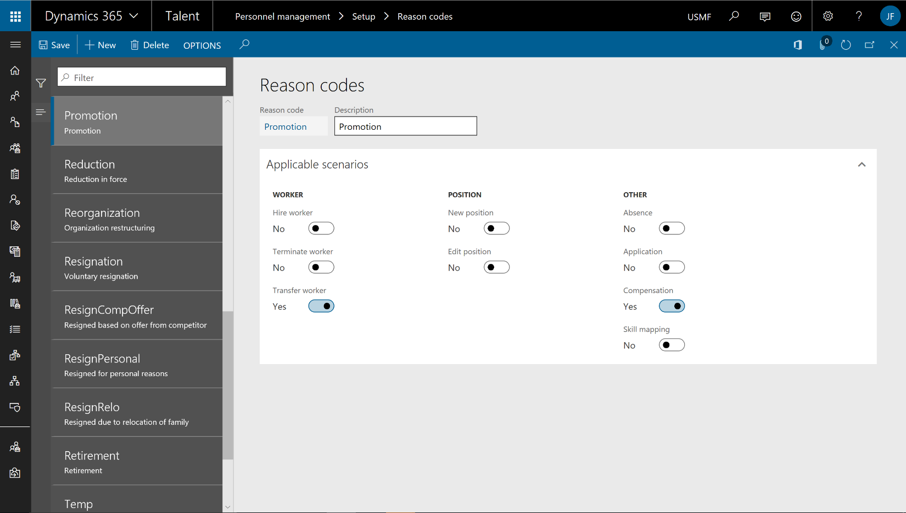

---

title: Contextual filtering of reason codes
description: This feature lets users configure reason codes for hire, transfer, termination, and compensation processes.
author: MargoC
manager: AnnBe
ms.date: 4/27/2018
ms.topic: article
ms.prod: 
ms.service: business-applications
ms.technology: 
ms.author: margoc
audience: Admin

---
#  Contextual filtering of reason codes

[!include[banner](../../../includes/banner.md)]

This feature lets users configure reason codes for hire, transfer, termination,
and compensation processes. This streamlines reason codes, increasing data
accuracy and providing better analytics for all processes that use reason codes.
It also makes hire, transfer, and termination processes more efficient by
displaying only the reason codes that are appropriate for the process.

<!-- Talent_Contextual filtering of reason codes_A.PNG -->

*Filtering of reason codes*
