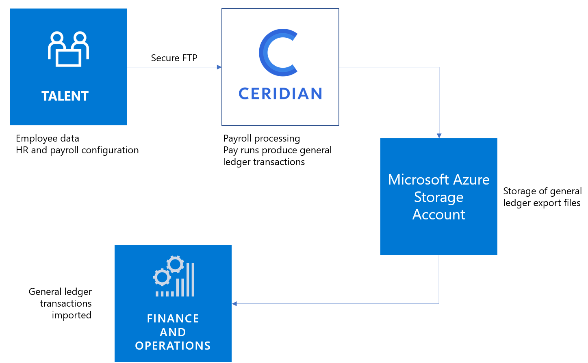

---

title: Payroll integration/payroll data package
description: Plug Talent into your broader HR technology ecosystem by connecting your payroll system through a purpose-built, out-of-box integration to Ceridian, or connect manually to other payroll providers.
author: MargoC
manager: AnnBe
ms.date: 4/27/2018
ms.topic: article
ms.prod: 
ms.service: business-applications
ms.technology: 
ms.author: margoc
audience: Admin

---
#  Payroll integration/payroll data package

[!include[banner](../../../includes/banner.md)]

Plug Talent into your broader HR technology ecosystem by connecting your payroll
system through a purpose-built, out-of-box integration to Ceridian, or connect
manually to other payroll providers.

-   **Ceridian Payroll integration** - HR and payroll configuration data,
    together with worker data, is sourced in Talent, whereas payroll processing
    is done within Ceridian’s Dayforce application. The resulting pay runs
    produce general ledger transactions that are imported into Finance and
    Operations. This functionality is now available for public preview in the
    UK.

-   **Generic payroll data export package** – If a customer is using a different
    payroll provider, they can modify the data included in the export package
    and then export the data package to any file storage location that their
    payroll software can access.

<!-- Talent_Payroll integration - Payroll data package_A.png -->

*Talent to Ceridian integration flow*
